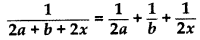
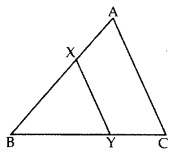
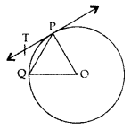
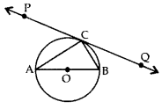
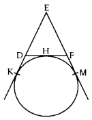

**WINGS ACADEMY, DHANBAD**

Foundation, NEET, JEE, JAM, GATE, NET

**Chapter 1: Real Numbers**

\1. The decimal expansion of the rational number 4324\*53 will terminate after how many places of decimals?

\2. Write the decimal form of  12927\*57\*75?

\3. Find the largest number that will divide 398, 436 and 542 leaving remainders 7, 11, and 15 respectively.

\4. If the HCF of 408 and 1032 is expressible in the form 1032 × 2 + 408 × p, then find the value of p.

\5. Express 98 as a product of its primes.

\6. 6. HCF and LCM of two numbers is 9 and 459 respectively. If one of the numbers is 27, find the other number.

\7. Find HCF and LCM of 13 and 17 by prime factorisation method.

\8. Find LCM of numbers whose prime factorisation are expressible as 3 × 52 and 32 × 72.

\9. Find the LCM of 96 and 360 by using fundamental theorem of arithmetic.

\10. Find the HCF (865, 255) using Euclid’s division lemma.

\11. Find the largest number which divides 70 and 125 leaving remainder 5 and 8 respectively.

\12. Find the prime factorisation of the denominator of rational number expressed as 6.12¯ in simplest form.

\13. Complete the following factor tree and find the composite number x.

\14. Prove that 2 + 3√5 is an irrational number.

\15. Show that 3√7 is an irrational number.

\16. Explain why (17 × 5 × 11 × 3 × 2 + 2 × 11) is a composite number.

\17. Check whether 4n can end with the digit 0 for any natural number n.
\18. Can two numbers have 15 as their HCF and 175 as their LCM? Give reasons.

\19. Prove that √5 is irrational and hence show that 3 + √5 is also irrational.

\20. Prove that 3 + 2√3 is an irrational number.

\21.  Three bells toll at intervals of 9, 12, 15 minutes respectively. If they start tolling together, after what time will they next toll together?

\22. Two tankers contain 850 liters and 680 liters of petrol. Find the maximum capacity of a container which can measure the petrol of each tanker in the exact number of times.

\23. The length, breadth, and height of a room are 8 m 50 cm, 6 m 25 cm and 4 m 75 cm respectively. Find the length of the longest rod that can measure the dimensions of the room exactly.

\24. Three alarm clocks ring at intervals of 4, 12 and 20 minutes respectively. If they start ringing together, after how much time will they next ring together?

\25. In a school, there are two Sections A and B of class X. There are 48 students in Section A and 60 students in Section B. Determine the least number of books required for the library of the school so that the books can be distributed equally among all students of each Section.

\26. By using Euclid’s algorithm, find the largest number which divides 650 and 1170.

\27. Find the HCF of 255 and 867 by Euclid’s division algorithm.

\28. Using Euclid’s division algorithm, find whether the pair of numbers 847, 2160 are coprime or not.

\29. Prove that 3 + 2√5 is irrational.

\30. There are 104 students in class X and 96 students in class IX in a school. In a house examination, the students are to be evenly seated in parallel rows such that no two adjacent rows are of the same class.

(a) Find the maximum number of parallel rows of each class for the seating arrangement.
(b) Also, find the number of students of class IX and also of class X in a row.
(c) What is the objective of the school administration behind such an arrangement?

\31. Dudhnath has two vessels containing 720 ml and 405 ml of milk respectively. Milk from these containers is poured into glasses of equal capacity to their brim. Find the minimum number of glasses that can be filled.

\32. Amita, Sneha, and Raghav start preparing cards for all persons of an old age home. In order to complete one card, they take 10, 16 and 20 minutes respectively. If all of them started together, after what time will they start preparing a new card together?

\33. Find HCF of numbers 134791, 6341 and 6339 by Euclid’s division algorithm.

\34. If two positive integers x and y are expressible in terms of primes as x = p2q3 and y = p3q, what can you say about their LCM and HCF. Is LCM a multiple of HCF? Explain.

\35. Show that one and only one out of n, (n + 1) and (n + 2) is divisible by 3, where n is any positive integer.

\36. Find the HCF and LCM of 306 and 657 and verify that LCM × HCF = Product of the two numbers.

\37. Show that any positive odd integer is of the form 41 + 1 or 4q + 3 where q is a positive integer.

**Chapter 2: Polynomials**

\1. If the sum of zeroes of the quadratic polynomial 3x2 **–** kx + 6 is 3, then find the value of k.

\2. If α and β are the zeroes of the polynomial ax2 + bx + c, find the value of α2 + β2.

\3. If the sum of the zeroes of the polynomial p(x) = (k2 – 14) x2 – 2x – 12 is 1, then find the value of k.

\4. If α and β are the zeroes of a polynomial such that α + β = -6 and αβ = 5, then find the polynomial.

\5. A quadratic polynomial, whose zeroes are -4 and -5, is ….

\6. Find the condition that zeroes of polynomial p(x) = ax2 + bx + c are reciprocal of each other.

\7. Form a quadratic polynomial whose zeroes are 3 + √2 and 3 – √2.

\8. Find a quadratic polynomial, the stun and product of whose zeroes are √3 and 1√3 respectively.

\9. Find a quadratic polynomial, the sum and product of whose zeroes are 0 and -√2 respectively.

\10. Find the zeroes of the quadratic polynomial √3 x2 – 8x + 4√3.

\11. If the zeroes of the polynomial x2 + px + q are double in value to the zeroes of 2x2 – 5x – 3, find the value of p and q.

\12. Can (x – 2) be the remainder on division of a polynomial p(x) by (2x + 3)? Justify your answer.

\13. Find a quadratic polynomial whose zeroes are 3+255and3+255.

\14. Find the quadratic polynomial whose zeroes are -2 and -5. Verify the relationship between zeroes and coefficients of the polynomial.

\15. Find the zeroes of the quadratic polynomial 3x2 – 75 and verify the relationship between the zeroes and the coefficients.

\16. Find the zeroes of p(x) = 2x2 – x – 6 and verify the relationship of zeroes with these co-efficients.

\17. What must be subtracted from the polynomial f(x) = x4 + 2x3 – 13x2 – 12x + 21 so that the resulting polynomial is exactly divisible by x2 – 4x + 3?

\18. Verify whether 2, 3 and 12 are the zeroes of the polynomial p(x) = 2x3 – 11x2 + 17x – 6.

\19. Show that 12 and −32 are the zeroes of the polynomial 4x2 + 4x – 3 and verify the relationship between zeroes and co-efficients of polynomial.

\20. Find a quadratic polynomial, the sum and product of whose zeroes are -8 and 12 respectively. Hence find the zeroes.

\21. Find a quadratic polynomial, the sum and product of whose zeroes are 0 and −35 respectively. Hence find the zeroes.

\22. Find the zeroes of the quadratic polynomial 6x2 – 3 – 7x and verify the relationship between the zeroes and the coefficients of the polynomial.

\23. Find the zeroes of the quadratic polynomial f(x) = x2 – 3x – 28 and verify the relationship between the zeroes and the co-efficients of the polynomial.

\24. If α and β are the zeroes of the polynomial 6y2 – 7y + 2, find a quadratic polynomial whose zeroes are 1/*α* and 1/*β*.

\25. Divide 3x2 + 5x – 1 by x + 2 and verify the division algorithm.

\26. On dividing 3x3 + 4x2 + 5x – 13 by a polynomial g(x) the quotient and remainder were 3x +10 and 16x – 43 respectively. Find the polynomial g(x).

\27. Check whether polynomial x – 1 is a factor of the polynomial x3 – 8x2 + 19x – 12. Verify by division algorithm.

\28. Divide 4x3 + 2x2 + 5x – 6 by 2x2 + 1 + 3x and verify the division algorithm.

\29. Given that x – √5 is a factor of the polynomial x3 – 3√5 x2 – 5x + 15√5, find all the zeroes of the polynomial.

\30. If a polynomial x4 + 5x3 + 4x2 – 10x – 12 has two zeroes as -2 and -3, then find the other zeroes.

\31. Find all the zeroes of the polynomial 8x4 + 8x3 – 18x2 – 20x – 5, if it is given that two of its zeroes are √5/2 and  −√5/2.

\32. If p(x) = x3 – 2x2 + kx + 5 is divided by (x – 2), the remainder is 11. Find k. Hence find all the zeroes of x3 + kx2 + 3x + 1.

\33. If α and β are zeroes of p(x) = kx2 + 4x + 4, such that α2 + β2 = 24, find k.

\34. If α and β are the zeroes of the polynomial p(x) = 2x2 + 5x + k, satisfying the relation, α2 + β2 + αβ = 214 then find the value of k. 

\35. What must be subtracted from p(x) = 8x4 + 14x3 – 2x2 + 8x – 12 so that 4x2 + 3x – 2 is factor of p(x)? This question was given to group of students for working together. 

\36. Find the values of a and b so that x4 + x3 + 8x2 +ax – b is divisible by x2 + 1.

\37. If a polynomial 3x4 – 4x3 – 16x2 + 15x + 14 is divided by another polynomial x2 – 4, the remainder comes out to be px + q. Find the value of p and q.

\38. If the polynomial (x4 + 2x3 + 8x2 + 12x + 18) is divided by another polynomial (x2 + 5), the remainder comes out to be (px + q), find the values of p and q.

**Chapter 3: Pair of Linear Equations in Two Variables**

\1. How many solutions does the pair of equations y = 0 and y = -5 have?

\2. If ax + by = a2 – b2 and bx + ay = 0, find the value of (x + y).

\3. For what value of k, the pair of equations 4x – 3y = 9, 2x + ky = 11 has no solution?

\4. Calculate the area bounded by the line x + y = 10 and both the co-ordinate axes.

\5. Find whether the following pair of linear equations is consistent or inconsistent: 3x + 2y = 8;  6x – 4y = 9

\6. Check graphically whether the pair of equations 3x – 2y + 2 = 0 and32x – y + 3 = 0, is consistent. Also find the coordinates of the points where the graphs of the equations meet the Y-axis.

\7. Draw the graph of 2y = 4x – 6; 2x = y + 3 and determine whether this system of linear equations has a unique solution or not.

\8. Represent the following pair of equations graphically and write the coordinates of points where the lines intersect y-axis.

\9. Solve the following pair of equations for x and y: 
a2x−b2y= 0;a2bx+b2ay= a + b, x ≠ 0; y ≠ 0

\10. Solve for x and y:
10x+y+2x-y=4;	15x+y−5x-y=−2 	;x + y ≠ 0,x – y ≠ 0

\11. Solve the following pair of linear equations for x and y:
`		`141x + 93y = 189;
`		`93x + 141y = 45

\12. Solve the following pair of linear equations for x and y: (2013)
ba*x*+ab*y* = a2 + b2; x + y = 2ab

\13. Solve by elimination: 
`		`3x = y + 5
`		`5x – y = 11

\14. Solve by elimination: 2015
`		`3x – y – 7
`		`2x + 5y + 1 = 0

\15. Solve for x and y: 
`		`27x + 31y = 85;
`		`31x + 2 7y = 89

\16. Solve for x and y: *x/a*=*y/b*;
`		`ax + by = a2+ b2

\17. Solve: *x/a*+*y/b* = a + b; *x/a*2+*y/b*2 =2, a, b ≠ 0

\18. Solve the following pair of equations: 
`		`49x + 51y = 499
`		`51x + 49 y = 501

\19. Find the two numbers whose sum is 75 and difference is 15.

\20. Find the value of a and p for which the following pair of linear equations has infinite number of solutions:
`			`2x + 3y = 7;
`			`αx + (α + β)y = 28

\21. Solve the following pair of linear equations by the cross multiplication method: x + 2y = 2; x – 3y = 7

\22. A man earns ₹600 per month more than his wife. One-tenth of the man’s salary and l/6th of the wife’s salary amount to ₹1,500, which is saved every month. Find their incomes.

\23. The sum of the digits of a two digit number is 8 and the difference between the number and that formed by reversing the digits is 18. Find the number.

\24. The age of the father is twice the sum of the ages of his 2 children. After 20 years, his age will be equal to the sum of the ages of his children. Find the age of the father.

\25. A two digit number is seven times the sum of its digits. The number formed by reversing the digits is 18 less than the given number. Find the given number.

\26. Sita Devi wants to make a rectangular pond on the road side for the purpose of providing drinking water for street animals. The area of the pond will be decreased by 3 square feet if its length is decreased by 2 ft. and breadth is increased by 1 ft. Its area will be increased by 4 square feet if the length is increased by 1 ft. and breadth remains same. Find the dimensions of the pond.

\27. On reversing the digits of a two digit number, number obtained is 9 less than three times the original number. If difference of these two numbers is 45, find the original number.

\28. Speed of a boat in still water is 15 km/h. It goes 30 km upstream and returns back at the same point in 4 hours 30 minutes. Find the speed of the stream.

\29. The owner of a taxi company decides to run all the taxis on CNG fuel instead of petrol/diesel. The taxi charges in city comprises of fixed charges together with the charge for the distance covered. For a journey of 12 km, the charge paid is 789 and for journey of 20 km, the charge paid is ₹145. What will a person have to pay for travelling a distance of 30 km?

\30. A boat takes 4 hours to go 44 km downstream and it can go 20 km upstream in the same time. Find the speed of the stream and that of the boat in still water.

\31. A man travels 300 km partly by train and partly by car. He takes 4 hours if the travels 60 km by train and the rest by car. If he travels 100 km by train and the remaining by car, he takes 10 minutes longer. Find the speeds of the train and the car separately.

\32. The owner of a taxi company decides to run all the taxis on CNG fuel instead of petrol/diesel. The taxi charges in city comprises of fixed charges together with the charge for the distance covered. For a journey of 13 km, the charge paid is ₹129 and for a journey of 22 km, the charge paid is ₹210. What will a person have to pay for travelling a distance of 32 km?

\33. Solve the following pair of linear equations graphically:
x + 3y = 6 ; 2x – 3y = 12
Also find the area of the triangle formed by the lines representing the given equations with y-axis.

\34. Draw the graphs of following equations:
2x – y = 1; x + 2y = 13
Find the solution of the equations from the graph and shade the triangular region formed by the lines and the y-axis.

\35. Draw the graphs of the equations x – y + 1 = 0 and 3x + 2y – 12 = 0. Determine the coordinates of the vertices of the triangle formed by these lines and x-axis.

\36. Amit bought two pencils and three chocolates for ₹11 and Sumeet bought one pencil and two chocolates for ₹7. Represent this situation in the form of a pair of linear equations. Find the price of one pencil and that of one chocolate graphically.

\37. 7x – 5y – 4 = 0 is given. Write another linear equation, so that the lines represented by the pair are:
(i) intersecting
(ii) coincident
(iii) parallel

**Chapter 4: Quadratic Equations**

\1.  Find the roots of the equation x2 – 3x – m (m + 3) = 0, where m is a constant.

2 If 1 is a root of the equations ay2 + ay + 3 = 0 and y2 + y + b = 0, then find the value of ab. 

\3. If x = – 12 , is a solution of the quadratic equation 3x2 + 2kx – 3 = 0, find the value of k. 

\4. If the quadratic equation px\frac{1}{2} – 25–√ px + 15 = 0 has two equal roots, then find the value of p. (2015OD)

\5. Find the value of p so that the quadratic equation px(x – 3) + 9 = 0 has two equal roots. (2011D, 2014OD)

\6. Find the roots of 4x2 + 3x + 5 = 0 by the method of completing the squares. (2011D ) Solution 

\7. Find the value of m so that the quadratic equation mx (x – 7) + 49 = 0 has two equal roots. 

8.Solve for x:
36x2 – 12ax + (a2 – b2) = 0 

\9. Find the value(s) of k so that the quadratic equation x2 – 4kx + k = 0 has equal roots. 

\10. Find the value of k for which the equation x2 + k(2x + k – 1) + 2 = 0 has real and equal roots. 

\11. Find the value of p for which the roots of the equation px(x – 2) + 6 = 0, are equal. 

12.Solve the following quadratic equation for x: 43–√x2 + 5x – 23–√ = 0  

13.Solve the following for x: 2–√x2 + 7x + 52–√ = 0 (2017D )

14.Solve the quadratic equation 2x2 + ax – a2 = 0 for x. 

\15. Find the values of p for which the quadratic equation 4x2 + px + 3 = 0 has equal roots. 
16.Solve the following quadratic equation for x: 4x2– 4a2x + (a4 – b4) = 0. 

17,Solve the following quadratic equation for x: 9x2 – 6b2x – (a4 – b4) = 0 

18.Solve the following quadratic equation for x: 4x2 + 4bx – (a2 – b2) = 0 (20150D)
19.Solve the following quadratic equation for x: x2 – 2ax – (4b2 – a2) = 0) (2015OD)

\20. If x = 23 and x = -3 are roots of the quadratic equation ax2 + 7x + b = 0, find the values of a and b. 

\21. Find the value of p, for which one root of the quadratic equation px2 – 14x + 8 = 0 is 6 times the other. (20170D)

\22. Find the value of p, for which one root of the quadratic equation px2 – 14x + 8 = 0 is 6 times the other. (20170D)

23.Solve for x: 2*x*+9−−−−−√ + x = 13. (20160D)

24.Solve for x: 6*x*+7−−−−−√ – (2x – 7) = 0 (20160D)

\25. Ind the roots of the following quadratic equation: 23–√x2 – 5x + √3 = 0 

26.Solve for x: 4x2 – 4ax + (a2 – b2) = 0 

27.Solve for x: 3x2} – 26–√ x + 2 = 0 

\28. Find the value(s) of k so that the quadratic equation 2x2 + kx + 3 = 0 has equal roots.

\29. Find the value(s) of k so that the quadratic equation 3x2 – 2kx + 12 = 0 has equal roots. 

30.Solve the following quadratic equation for x: x2 – 4ax – b2 + 4a2 = 0 

\31. Find the value of k for which the roots of the equation kx(3x – 4) + 4 = 0, are equal. (20120D)

\32. Find the value of m for which the roots of the equation. mx (6x + 10) + 25 = 0, are equal. 

\33. For what value of k, the roots of the quadratic equation kx(x – 25–√) + 10 = 0, are equal? 

\34. For what values of k, the roots of the quadratic equation (k + 4)x2 + (k + 1)x + 1 = 0 are equal? 

\35. For what value of k, are the roots of the quadratic equation: (k – 12)x2 + 2(k – 12)x + 2 = 0 equal? 

\36. For what value of k, are the roots of the quadratic equation y2 + k2 = 2 (k + 1)y equal? 

\37. Find that non-zero value of k, for which the quadratic equation kx2 + 1 – 2(k – 1)x + x2 = 0 has equal roots. Hence find the roots of the equation. 

\38. Find that value of p for which the quadratic equation (p + 1)x2 – 6(p + 1)x + 3 (p + 9) = 0, p ≠ -1 had equal roots. (2015D

39.Solve for x: 3–√x2 – 223−−√x – 23–√ = 0 (2015OD)

40.Solve for x: 2x2 + 63–√x – 60 = 0 (2015OD)

\41. If the roots of the quadratic equation (a – b)x2 + (b – c)x + (c – a) = 0 are equal, prove that 2a = b + c. 

42.Solve the equation 4*x*−3=52*x*+3;*x*≠0,−32, for x. 

43.Solve the equation 3*x*+1−12=23*x*−1; x ≠ -1, x ≠ 13 for x. 

44.Solve the equation 14*x*+3−1=5*x*+1; x ≠ -3, -1, for x. 

45.Solve for x: 2*xx*−3+12*x*+3+3*x*+9(*x*−3)(2*x*+3) = 0, x ≠ 3, −32

46.Solve for x: *x*−1*x*−1+*x*−2*x*+2=4−2*x*+3*x*−2; x ≠1, -2, 2 

47.Solve the following quadratic equation for x: *x*2+(*aa*+*b*+*a*+*ba*)*x*+1=0 

48.Solve for x: 1(*x*−1)(*x*−2)+1(*x*−2)(*x*−3)=23, x ≠ 1, 2, 3 

\49. Three consecutive natural numbers are such that the square of the middle number exceeds the difference of the squares of the other two by 60. Find the numbers. 

\50. If the sum of two natural numbers is 8 and their product is 15, find the numbers.

\51. Find the values of k for which the quadratic equation (3k + 1)x2 + 2(k + 1)x + 1 = 0 has equal roots. Also find the roots. 

\52. Find the value of p for which the quadratic equation (2p + 1)x2 – (7p + 2)x + (7p – 3) = 0 has equal roots. Also find these roots. 

\53. Find the roots of the equation 1*x*+4−1*x*−7=1130, x ≠ -4, 7 

\54. Find the roots of the equation: 12*x*−3+1*x*−5=1, x ≠ 32, 5. 

55.Solve for x:
1*x*−3+2*x*−2=8*x*; x ≠ 0, 2, 3 

56.Solve for x: 4*x*−3=52*x*+3; x ≠ 0, −32 

57.Solve for x: *x*−2*x*−3+*x*−4*x*−5=103; x ≠ 3, 5 

58.Solve for x: 3*x*+1+4*x*−1=294*x*−1;*x*≠1,−1,14 

59.Solve for x: 2*x*+1+32(*x*−2)=235*x*,*x*≠0,−1,2 

\60. Find x in terms of a, b and c: *ax*−*a*+*bx*−*b*=2*cx*−*c*, x ≠ a, b, c 

61.Solve the following for x:  

\62. A shopkeeper buys some books for 80. If he had bought 4 more books for the same amount, each book would have cost ₹1 less. Find the number of books he bought. 

63.Sum of the areas of two squares is 400 cm2. If the difference of their perimeters is 16 cm, find the sides of the two squares. 

\64. The diagonal of a rectangular field is 16 metres more than the shorter side. If the longer side is 14 metres more than the shorter side, then find the lengths of the sides of the field. (2015OD)

\65. The sum of three numbers in A.P. is 12 and sum of their cubes is 288. Find the numbers. 

\66. The perimeter of a right triangle is 60 cm. Its hypotenuse is 25 cm. Find the area of the triangle. 

\67. The sum of two numbers is 9 and the sum of their reciprocals is 12. Find the numbers. 

\68. The numerator of a fraction is 3 less than its denominator. If 1 is added to the denominator, the fraction is decreased by 115. Find the fraction. (20120D)

\69. The difference of two natural numbers is 5 and the difference of their reciprocals is 110. Find the numbers. 

\70. The difference of two natural numbers is 5 and the difference of their reciprocals is 514. Find the numbers. 

\71. The numerator of a fraction is 3 less than its denominator. If 2 is added to both the numerator and the denominator, then the sum of the new fraction and original fraction is a 2920. Find the original fraction. 

\72. A rectangular park is to be designed whose breadth is 3 m less than its length. Its area is to be 4 square metres more than the area of a park that has already been made in the shape of an isosceles triangle with its base as the breadth of the rectangular park and of altitude 12 m. Find the length and breadth of the rectangular park. 

\73. A train travels 180 km at a uniform speed. If the speed had been 9 km/hour more, it would have taken 1 hour less for the same journey. Find the speed of the train.

\74. In a flight of 2800 km, an aircraft was slowed down due to bad weather. Its average speed is reduced by 100 km/h and time increased by 30 minutes. Find the original duration of the flight. 

75.While boarding an aeroplane, a passenger got hurt. The pilot, showing promptness and concern, made arrangements to hospitalise the injured and so the plane started late by 30 minutes. To reach the destination, 1500 km away in time, the pilot increased the speed by 100 km/hour. Find the original speed/hour of the plane.

\76. A train travels at a certain average speed for a distance of 54 km and then travels a distance of 63 km at an average speed of 6 km/h more than the first speed. If it takes 3 hours to complete the total journey, what is its first speed? (2015OD)

\77. A bus travels at a certain average speed for a distance of 75 km and then travels a distance of 90 km at an average speed of 10 km/h more than the first speed. If it takes 3 hours to complete the total journey, find its first speed. (2015OD)

\78. A truck covers a distance of 150 km at a certain average speed and then covers another 200 km at an average speed which is 20 km per hour more than the first speed. If the truck covers the total distance in 5 hours, find the first speed of the truck. (2015OD)

\79. Two pipes running together can fill a tank in 1119 minutes. If one pipe takes 5 minutes more than the other to fill the tank separately, find the time in which each pipe would fill the tank separately. 

\80. A motor boat whose speed is 20 km/h in still water, takes 1 hour more to go 48 km upstream than to return downstream to the same spot. Find the speed of the stream. 

\81. A motorboat whose speed in still water is 18 km/h, takes 1 hour more to go 24 km upstream than to return downstream to the same spot.
Find the speed of the stream. 

\82. The time taken by a person to cover 150 km was 2 hours more than the time taken in the return journey. If he returned at a speed of 10 km/hour more than the speed while going, find the speed per hour in each direction. (2016\D)

\83. To fill a swimming pool two pipes are to be used. If the pipe of larger diameter is used for 4 hours and the pipe of smaller diameter for 9 hours, only half the pool can be filled. Find, how long it would take for each pipe to fill the pool separately, if the pipe of smaller diameter takes 10 hours more than the pipe of larger diameter to fill the pool. 

**Chapter 5: Arithmtic Progrssion**

\1. Find the common difference of the AP 1p,1-pp,1-2pp….

\2. Find the common difference of the A.P. 12b,1-6b2b,1-12b2b,....

\3. Find the common difference of the A.P. 13q,1-6q3q,1-12q3q,.....

4..Calculate the common difference of the A.P. 1b,3-b3b,3-2b3b,.......

5.Calculate the common difference of the A.P.13,1-3b3,1-6b3,.........

6.What is the common difference of an A.P. in which a21 – a7 = 84? (2017OD 

\7. Find the 9th term from the end (towards the first term) of the A.P. 5,9,13, …, 185.

\8. The angles of a triangle are in A.P., the least being half the greatest. Find the angles.

\9. Find whether -150 is a term of the A.P. 17, 12, 7, 2, … ? 

10.Which term of the progression 4, 9, 14, 19, … is 109? 

11.Which term of the progression 20, 192, 183, 17 … is the first negative term?

\12. The 4th term of an A.P. is zero. Prove that the 25th term of the A.P. is three times its 11thterm. 

\13. The 7th term of an A.P. is 20 and its 13th term is 32. Find the A.P. 

\14. Find 10th term from end of the A.P. 4,9, 14, …, 254. 

\15. Find how many two-digit numbers are divisible by 6? 

\16. How many natural numbers are there between 200 and 500, which are divisible by 7? 

\17. How many two-digit numbers are divisible by 3? 

\18. How many three-digit natural numbers are divisible by 7? 

\19. Find the number of all three-digit natural numbers which are divisible by 9. 

\20. Find the number of natural numbers between 101 and 999 which are divisible by both 2 and 5. 

\21. Find the middle term of the A.P. 6, 13, 20, …, 216. 

\22. Find the middle term of the A.P. 213, 205, 197, … 37. 

\23. How many terms of the A.P. 27, 24, 21, … should be taken so that their sum** is zero? 

\24. How many terms of the A.P. 65, 60, 55, … be taken so that their sum is zero?  

\25. Find the sum of the first 25 terms of an A.P. whose nth term is given by tn = 2 – 3n.

\26. The first and the last terms of an AP are 5 and 45 respectively. If the sum of all its terms is 400, find its common difference. 

\27. The first and the last terms of an AP are 8 and 65 respectively. If the sum of all its terms is 730, find its common difference. 

\28. In an AP, if S5 + S7 = 167 and S10 = 235, then find the AP, where s, denotes the sum of its first n terms. (2015OD)

\29. Find the sum of all three digit natural numbers, which are multiples of 11. 

\30. Which term of the A.P. 3, 14, 25, 36, … will be 99 more than its 25th term? 

\31. Determine the A.P. whose fourth term is 18 and the difference of the ninth term from the fifteenth term is 30. 

\32. The 19th term of an AP is equal to three times its 6th term. If its 9th term is 19, find the A.P. 

\33. The 9th term of an A.P. is equal to 6 times its second term. If its 5th term is 22, find the A.P. 

\34. The sum of the 5th and the 9th terms of an AP is 30. If its 25th term is three times its 8th term, find the AP. 

\35. If the seventh term of an AP is 19 and its ninth term is 17, find its 63rd term. 

\36. Find the value of the middle term of the following A.P.: -6, -2, 2, …, 58. 

\37. Find the number of terms of the AP 18, 151/2, 13,…, -491/2 and find the sum of all its terms.

\38. The 14th term of an AP is twice its gth term. If its 6th term is -8, then find the sum of its first 20 terms. (2015OD)

\39. The 13th term of an AP is four times its 3rd term. If its fifth term is 16, then find the sum of its first ten terms. (2015OD)

\40. If the sum of first 7 terms of an A.P is 49 and that of its first 17 terms is 289, find the sum of first n terms of the A.P. 

\41. The first term of an A.P. is 5, the last term is 45 and the sum of all its terms is 400. Find the number of terms and the common difference of the A.P. 

\42. The nth term of an A.P. is given by (-4n + 15). Find the sum of first 20 terms of this A.P. 

\43. The sum of first n terms of an AP is 3n2 + 4n. Find the 25th term of this AP. 

\44. The sum of the first seven terms of an AP is 182. If its 4th and the 17th terms are in the ratio 1 : 5, find the AP. 

\45. If Sn, denotes the sum of first n terms of an A.P., prove that S12 = 3(S8 – S4). 

\46. If the sum of the first n terms of an A.P. is12 (3n2 + 7n), then find its     nth term. Hence write its 20th 

\47. If Sn denotes the sum of first n terms of an A.P., prove that S30 = 3[S20 – S10].  

\48. If the ratio of the sum of first n terms of two A.Ps is (7n + 1): (4n + 27), find the ratio of their mth terms. 

\49. The digits of a positive number of three digits are in A.P. and their sum is 15. The number obtained by reversing the digits is 594 less than the original number. Find the number. 

\50. The sums of first n terms of three arithmetic progressions are S1 S2 and S3 respectively. The first term of each A.P. is 1 and their common differences are 1, 2 and 3 respectively. Prove that S1 + S3 = 2S2. 

\51. Find the sum of all three digit natural numbers, which are multiples of 9. 

\52. Find the sum of all multiples of 7 lying between 500 and 900. 

\53. If pth, qth and rth terms of an A.P. are a, b, c respectively, then show that (a – b)r + (b – c)p+ (c – a)q = 0. 

\54. If pth, qth and rth terms of an A.P. are a, b, c respectively, then show that (a – b)r + (b – c)p+ (c – a)q = 0. 

\55. The 15th term of an AP is 3 more than twice its 7th term. If the 10th term of  the AP is 41, then find its nth term.    

\56. The 16th term of an AP is 1 more than twice its 8th term. If the 12th term of the AP is 47, then find its nth term. 

\57. A sum of ₹1,600 is to be used to give ten cash prizes to students of a school for their overall academic performance. If each prize is ₹20 less than its preceding prize, find the value of each of the prizes. 

\58. Find the 60th term of the AP 8, 10, 12, …, if it has a total of 60 terms and hence find the sum of its last 10 terms. (2015OD)

\59. An Arithmetic Progression 5, 12, 19, … has 50 terms. Find its last term. Hence find the sum of its last 15 terms. (2015OD)

\60. If the sum of first 4 terms of an A.P. is 40 and that of first 14 terms is 280, find the sum of its first n terms. 

\61. The first and the last terms of an A.P. are 8 and 350 respectively. If its common difference is 9, how many terms are there and what is their sum? 

\62. Sum of the first 20 terms of an AP is -240, and its first term is 7. Find its 24th term.

\63. Find the common difference of an A.P. whose first term is 5 and the sum of its first four terms is half the sum of the next four terms. 

\64. If the sum of the first 7 terms of an A.P. is 119 and that of the first 17 terms is 714, find the sum of its first n terms. 

\65. The 24th term of an AP is twice its 10th term. Show that its 72nd term is 4 times its 15th term. 

\66. Find the number of terms of the A.P. -12, -9, – 6, …, 21. If 1 is added to each term of this A.P., then find the sum of all terms of the A.P. thus obtained. 

\67. In an AP of 50 terms, the sum of first 10 terms is 210 and the sum of its last 15 terms is 2565. Find the AP. 

\68. If the ratio of the sum of the first n terms of two A.Ps is (7n + 1): (4n + 27), then find the ratio of their 9th terms. 

\69. In a school, students decided to plant trees in and around the school to reduce air pollution. It was decided that the number of trees, that each section of each class will plant, will be double of the class in which they are studying. If there are 1 to 12 classes in the school and each class has two sections, find how many trees were planted by the students. 

\70. Ramkali required ₹500 after 12 weeks to send her daughter to school. She saved ₹100 in the first week and increased her weekly saving by ₹20 every week. Find whether she will be able to send her daughter to school after 12 weeks. 

\71. The sum of first n terms of an A.P. is 5n2 + 3n. If its mth term is 168, find the value of m. Also find the 20th term of this A.P. 

\72. The sum of first m terms of an AP is 4m2 – m. If its nth term is 107, find the value of n. Also find the 21st term of this A.P. 

\73. The sum of first g terms of an A.P. is 63q – 3q2. If its pth term is -60, find the value of p. Also find the 11th term of this A.P. 

\74. Find the sum of the first 30 positive integers divisible by 6. 

\75. How many multiples of 4 lie between 10 and 250? Also find their sum. 

\76. Find the sum of all multiples of 8 lying between 201 and 950. 

\77. Find the sum of all multiples of 9 lying between 400 and 800. 

\78. A thief runs with a uniform speed of 100 m/minute. After one minute a policeman runs after the thief to catch him. He goes with a speed of 100 m/minute in the first minute and increases his speed by 10 m/minute every succeeding minute. After how many minutes the policeman will catch the   thief. 

\79. A thief, after committing a theft, runs at a uniform speed of 50 m/minute. After 2 minutes, a policeman runs to catch him. He goes 60 m in first minute and increases his speed by 5 m/ minute every succeeding minute. After how many minutes, the policeman will catch the thief? 

\80. The houses in a row are numbered conse cutively from 1 to 49. Show that there exists a value of X such that sum of numbers of houses preceding the house numbered X is equal to sum of the numbers of houses following X. 

\81. Find the sum of n terms of the series (4−1*n*)+(4−2*n*)+(4−3*n*)+……. 

**Chapter-6 Triangle**

\1. If ∆ABC ~ ∆PQR, perimeter of ∆ABC = 32 cm, perimeter of ∆PQR = 48 cm and PR = 6 cm, then find the length of AC. 

\2. ∆ABC ~ ∆DEF. If AB = 4 cm, BC = 3.5 cm, CA = 2.5 cm and DF = 7.5 cm, find the perimeter of ∆DEF. (2012, 2017D)

\3. If ∆ABC ~ ∆RPQ, AB = 3 cm, BC = 5 cm, AC = 6 cm, RP = 6 cm and PQ = 10, then find QR. 

\4. In ∆DEW, AB || EW. If AD = 4 cm, DE = 12 cm and DW = 24 cm, then find the value of DB. 

5. In ∆ABC, DE || BC, find the value of x. 

\6. In the given figure, if DE || BC, AE = 8 cm, EC = 2 cm and BC = 6 cm, then find DE. 

7. In the given figure, XY || QR, PQ/XQ = 7/3 and PR = 6.3 cm, find YR. 

\8. The lengths of the diagonals of a rhombus are 24 cm and 32 cm. Calculate the length of the altitude of the rhombus. (2013)

\9. If PQR is an equilateral triangle and PX ⊥ QR, find the value of PX2. (2013)

\10. The sides AB and AC and the perimeter P, of ∆ABC are respectively three times the corresponding sides DE and DF and the perimeter P, of ∆DEF. Are the two triangles similar? If yes, find *ar*(△*ABC*)/*ar*(△*DEF*)  

11. In the figure, EF || AC, BC = 10 cm, AB = 13 cm and EC = 2 cm, find AF. 

\12. X and Y are points on the sides AB and AC respectively of a triangle ABC such that **AX/**A**B**=1/4, AY = 2 cm and YC = 6 cm. Find whether XY || BC or not.

13. In the given figure, ∠A = 90°, AD ⊥ BC. If BD = 2 cm and CD = 8 cm, find AD. (2012; 2017D)

\14. In ∆ABC, ∠BAC = 90° and AD ⊥ BC. Prove that AD2 =BD \* CD.

\15. A 6.5 m long ladder is placed against a wall such that its foot is at a distance of 2.5 m from the wall. Find the height of the wall where the top of the ladder touches it. 

16. In the figure ABC and DBC are two right triangles. Prove that AP × PC = BP × PD. (2013)

17. In the given figure, QA ⊥ AB and PB ⊥ AB. If AO = 20 cm, BO = 12 cm, PB = 18 cm, find AQ.

18. In the given figure, CD || LA and DE || AC. Find the length of CL if BE = 4 cm and EC = 2 cm. 

\19. If a line segment intersects sides AB and AC of a ∆ABC at D and E respectively and is parallel to BC, prove that *ADAB*=*AEAC*. (2013)

20. In a ∆ABC, DE || BC with D on AB and E on AC. If *ADDB*=34 , find **B***C***DE**. (2013)

\21. In the figure, if DE || OB and EF || BC, then prove that DF || OC. 

\22. If the perimeters of two similar triangles ABC and DEF are 50 cm and 70 cm respectively and one side of ∆ABC = 20 cm, then find the corresponding side of ∆DEF. 

\23. A vertical pole of length 8 m casts a shadow 6 cm long on the ground and at the same time a tower casts a shadow 30 m long. Find the height of tower. 

\24. In given figure, EB ⊥ AC, BG ⊥ AE and CF ⊥ AE 

\25. ∆ABC ~ ∆PQR. AD is the median to BC and PM is the median to QR. Prove that **ABPQ**=**ADPM**. 

26. State whether the given pairs of triangles are similar or not. In case of similarity mention the criterion. 

27. In the figure of ∆ABC, D divides CA in the ratio 4 : 3.

. If DE || BC, then find ar (BCDE) : ar (∆ABC). 

\28. In the given figure, DE || BC and AD : DB = 7 : 5.

Find ar(∆DEF)**/**ar(∆CFB).

29. In the given figure, the line segment XY is parallel to the side AC of ∆ABC and it divides the triangle into two parts of equal areas. Find the ratio **AXAB** 

30. In the given figure, AD ⊥ BC and BD = 13CD. Prove that 2AC2 = 2AB2 + BC2. 

31. In the given figure, ∆ABC is right-angled at C and DE ⊥ AB. Prove that ∆ABC ~ ∆ADE and hence find the lengths of AE and DE. (2012, 2017D)

\32. In ∆ABC, if AP ⊥ BC and AC2 = BC2 – AB2, then prove that PA2 = PB × CP.  

\33. ABCD is a rhombus. Prove that AB2 + BC2 + CD2 + DA2 = AC2 + BD2. (2013)

\34. The diagonals of trapezium ABCD intersect each other at point o. If AB = 2CD, find the ratio of area of the ∆AOB to area of ∆COD. (2013)

\35. The diagonals of a quadrilateral ABCD intersect each other at the point O such that *AOBO*=*CODO*. Show that ABCD is a trapezium. 

\36. In a rectangle ABCD, E is middle point of AD. If AD = 40 m and AB = 48 m, then find EB. 

37.Let ABC be a triangle and D and E be two points on side AB such that AD = BE. If DP || BC and EQ || AC, then prove that PQ || AB. (2013)

38. In the figure, ∠BED = ∠BDE & E divides BC in the ratio 2 : 1. Prove that AF × BE = 2 AD × CF. 

39. In the given figure, AD = 3 cm, AE = 5 cm, BD = 4 cm, CE = 4 cm, CF = 2 cm, BF = 2.5 cm, then find the pair of parallel lines and hence their lengths.  

\40. If sides AB, BC and median AD of AABC are proportional to the corresponding sides PQ, QR and median PM of PQR, show that ∆ABC ~ ∆PQR. 

\41. Prove that the ratio of the areas of two similar triangles is equal to the ratio of the squares of their corresponding sides. 

\42. State and prove converse of Pythagoras theorem. Using the above theorem, solve the following: In ∆ABC, AB = 6√3 cm, BC = 6 cm and AC = 12 cm, find ∠B. 

43. In the given figure, BL and CM are medians of a triangle ABC, right angled at A. Prove that: 4(BL2 + CM2) = 5BC2 

\44. In the given figure, AD is median of ∆ABC and AE ⊥ BC.  Prove that b2 + c2 = 2p2 + 1/2 a2.

\45. In a ∆ABC, the perpendicular from A on the side BC of a AABC intersects BC  at D such that DB = 3 CD. Prove that 2 AB2 = 2 AC2 + BC2. 

\46. In ∆ABC, altitudes AD and CE intersect each other at the point P. Prove that: 
(i) ∆APE ~ ∆CPD
(ii) AP × PD = CP × PE
(iii) ∆ADB ~ ∆CEB
(iv) AB × CE = BC × AD

\47. In the figure, PQR and QST are two right triangles, right angled at R and T respectively. Prove that QR × QS = QP × QT. 

48. In the given figure, ABC and DBC are two triangles on the same base BC. If  AD intersects BC at O, show that *ar*(*ABC*)/*ar*(*DBC*)=*AO/DO*. 

\49. Hypotenuse of a right triangle is 25 cm and out of the remaining two sides, one is longer than the other by 5 cm. Find the lengths of the other two sides. 

50. In Figure, AB ⊥ BC, FG ⊥ BC and DE ⊥ AC. Prove that ∆ADE ~ ∆GCF. 

**Chapter 7. Coordinate Geometry**

\1. The distance of the point P (2, 3) from the x-axis is

(A) 2 (B) 3 (C) 1 (D) 5

2.** Find a relation between x and y such that the point (x, y) is equidistant from the points (7, 1) and (3, 5).

3.** Find the coordinates of the points of trisection (i.e., points dividing into three equal parts) of the line segment joining the points A(2, – 2) and B(– 7, 4).

\4. Find the ratio in which the line segment joining the points (– 3, 10) and (6, – 8) is divided by (– 1, 6).

\5. Find the value of k if the points A(2, 3), B(4, k) and C(6, –3) are collinear.

\6. Find the area of the triangle formed by joining the mid-points of the sides of the triangle whose vertices are (0, –1), (2, 1) and (0, 3). Find the ratio of this area to the area of the given triangle.

7.** Name the type of triangle formed by the points A (–5, 6), B (–4, –2) and C (7, 5).

\8. The centre of a circle is (2a, a – 7). Find the values of a, if the circle passes through the point (11, –9) and has a diameter 10√ 2 units.

\9. Find the ratio in which the line 2x + 3y – 5 = 0 divides the line segment joining the points (8, –9) and (2, 1). Also, find the coordinates of the point of division.

\10. Show that the points (1, 7), (4, 2), (–1, –1) and (– 4, 4) are the vertices of a square.

\11. Find the point on the x-axis, which is equidistant from (2, –5) and (–2, 9).

\12. Find the area of a rhombus if its vertices are (3, 0), (4, 5), (– 1, 4) and (– 2, – 1) taken in order. [**Hint**: Area of a rhombus = 1/2 (product of its diagonals)]

\13. If the points A (1, –2), B (2, 3) C (a, 2) and D (– 4, –3) form a parallelogram, find the value of a and height of the parallelogram taking AB as the base.

\14. Find the ratio in which y-axis divides the line segment joining the points A(5, -6) and B(-l, -4). Also find the coordinates of the point of division.

\15. The x-coordinate of a point P is twice its y-coordinate. If P is equidistant from Q(2, -5) and R(-3, 6), find the coordinates of P.

\16. Let P and Q be the points of trisection of the line segment joining the points A(2, -2) and B(-7, 4) such that P is nearer to A. Find the coordinates of P and Q.

\17. Prove that the points (3,0), (6,4) and (-1,3) are the vertices of a right angled isosceles triangle.

\18. Prove that the points (3,0), (6,4) and (-1,3) are the vertices of a right angled isosceles triangle.

\19. Prove that the points (2, -2), (-2, 1) and (5, 2) are the vertices of a right angled triangle. Also find the area of this triangle.

\20. In figure ABC is a triangle coordinates of whose vertex A are (0, -1). D and E respectively are the mid-points of the sides AB and AC and their coordinates are (1, 0) and (0,1) respectively. If F is the mid-point of BC, find the areas of ∆ABC and ∆DEF.

\21. If the point P(x, y) is equidistant from the points A (a + b, b – a) and B(a -b,a+ b). Prove that bx = ay.

\22. If the point C(-l, 2) divides internally the line-segment joining the points A(2, 5) and B(x,y) in the ratio 3 : 4, find the value of  x2 + y2.

\23. Prove that the area of a triangle with vertices (t, t – 2), (t + 2, t + 2) and (t + 3, t) is independent of t.

24. In fig., the vertices of AABC are A(4, 6), B(l, 5) and C(7, 2). A line-segment DE is drawn to intersect the sides AB and AC at D and E respectively such that AD/AC=AE/AC=1/3. Calculate the area of ∆ADE and compare it with area of ∆ABC.

25. The coordinates of the points A, B and C are (6,3), (-3,5) and (4, -2) respectively. P(JC, y) is any point in the plane. Show that 

\26. Find the area of the quadrilateral ABCD, the coordinate of whose vertices are A(1, 2), B(6,2), C(5,3) and D(3,4).

\27. Find a relation between x and y such that the point P(x, y) is equidistant from the points A (2, 5) and B (-3, 7).

\28. Find the area of a quadrilateral ABCD, the coordinates of whose vertices are A(—3,2), B(5,4), C(7, -6) and D(-5, -4).

\29. Find the ratio in which the point P P(3/4,5/12) divides the line segment joining the points A(1/2,3/2) and 3(2, -5).

\30. The points A(4,7), B(p, 3) and C(7,3) are the vertices of a right triangle, right-angled at B. Find the value of p.

\31. Find the relation between x and y if the points A(x, y), B(-5, 7) and C(-4, 5) are collinear

\32. Show that the points (a,a), (-a,-a) and (-√3a, √3 a) are the vertices of an equilateral triangle.

\33. For what values of k are the points (8,1), (3, -2k) and (k, -5) collinear?

\34. Find the area of the triangle ABC with A(l, -4) and mid-points of sides through A being (2, -1) and (0, -1).

\35. Point A lies on the line segment PQ joining P(6, -6) and Q(-4, -1) in such a way that PA/PQ=2/5. If point P also lies on the line 3x + k(y + 1) = 0, find the value of k

\36. Find the coordinates of a point P on the line segment joining A(l, 2) and B(6,7) such that AP=2/5AB

\37. If A(-4,8), B(-3, -4), C(0, – 5) and D(5,6) are the vertices of a quadrilateral ABCD, find its area.

\38. Find the values of k so that the area of the triangle with vertices (1, -1), (-4,2k) and (-k, – 5) is 24 sq. units.

\39. Find the values of k for which the points A(k + 1, 2k), B(3k, 2k + 3) and C(5k – 1, 5k) are collinear.

\40. The base BC of an equilateral triangle ABC lies on y-axis. The coordinates of point C are (0, -3). The origin is the mid-point of the base. Find the coordinates of the points A and B. Also find the coordinates of another point D such that BACD is a rhombus.

\41. If the point A(0, 2) is equidistant from the points B(3, p) and C(p, 5), find p. Also find the length of AB.

\42. If the points A(-2,1), B (a, b) and C(4, -1) are collinear and a – b = 1, find the value of a and b.

\43. Points A(-l, y) and B(5,7) lie on a circle with centre 0(2, -3y). Find the values ofy. Hence, find the radius of the circle.

\44. Find the ratio in which the line segment joining the points A(3, -3) and B(-2, 7) is divided by x-axis. Also find the coordinates of the point of division.

\45. Find the value(s) of k for which the points (3k – 1, k – 2), (k, k-1) and (k – 1, – k – 2) are collinear.

\46. points P, Q, R and S divide the line segment joining the points A(l, 2) and B(6, 7) in 5 equal parts. Find the coordinates of the points P, Q and R.

\47. Find the ratio in which the point P(x, 2) divides the line segment joining the points A(12,5) and B(4, -3). Also, find the value of x.

\48. A(4, -6), B(3, -2) and C(5, 2) are the vertices of a AABC and AD is its median. Prove that the median AD divides AABC into two triangles of equal areas.

\49. If A(4,2), B(7,6) and C(l, 4) are the vertices of a ∆ABC and AD is its median, prove that the median AD divides ∆ABC into two triangles of equal areas.

\50. The mid-point P of the line segment joining the points A(- 10, 4) and B(- 2, 0) lies on the line segment joining the points C(- 9, – 4) and D(- 4, y). Find the ratio in which P divides CD. Also find the value of y.

\51. Prove that the points (7,10), (-2,5) and (3, -4) are the vertices of an isosceles right triangle.

\52. Find, the ratio in which the y-axis divides the line segment joining the points (-4, -6) and (10,12). Also find the coordinates of the point of division.

\53. Prove that the points A(0, -1), B(-2, 3), C(6, 7) and D(8, 3) are the vertices of a rectangle ABCD?

\54. Show that the points (-2,3) (8,3) and (6, 7) are the vertices of a right triangle.

\55. Prove that the points A(2, 3), B(-2, 2), C(-l, -2) and D(3, -1) are the vertices of a square ABCD.

\56. Find the ratio in which point P(-l, y) lying on the line segment joining points A(-3,10) and 

B(6, -8) divides it. Also find the value of y.

\57. Prove that the points A(2, -1), B(3, 4), C(-2, 3) and D(-3, -2) are the vertices of a rhombus ABCD. Is ABCD a square?

\58. Find that value of k for which the point (0, 2) is equidistant from two points (3, k) and (k, 5).

\59. If the point P(x,y) is equidistant from two points A (-3,2) and B (4, -5), prove that y = x- 2.

\60. The line segment AB joining the points A(3, – 4), and B(l, 2) is trisected at the points P(p, – 2) and Q(5/3, q). Find the values of p and q.

\61. If the point A (x, y) is equidistant from two points P (6, -1) and Q (2,3), prove that y = x – 3.

\62. If the point R (x, y) is equidistant from two points P (- 3, 4) and Q (2, – 1), prove that y = x + 2.

\63. If the area of AABC formed by A(x, y), B(l, 2) and C(2, 1) is 6 square units, then prove that x +y= 15.

\64. Find the value of x for which the points (x – 1), (2,1) and (4,5) are collinear.

\65. The three vertices of a parallelogram ABCD are A(3, -4), B(-l, -3) and C(-6, 2). Find the coordinates of vertex D and find the area of parallelogram ABCD.

\66. If the points A(l, -2), B(2,3), C(-3,2) and D(-4, -3) are the vertices of parallelogram ABCD, then taking AB as the base, find the height of this parallelogram.

\67. For the AABC formed by the points A(4, -6), B(3, -2) and C(5,2), verify that median divides the triangle into two triangles of equal area.

\68. Find the area of a parallelogram ABCD if three of its vertices are A(2, 4), B(2 + √3,5) and C(2, 6).

\69. If the area of the triangle formed by points A (x,y), B (1,2) and C (2,1) is 6 square units, then show that x + y = 15.

\70. Find the area of the triangle formed by joining the mid-points of the sides of a triangle whose vertices are (3,2), (5,4) and (3, 6).

\71. If the area of the triangle formed by joining the points A (x, y), B (3, 2) and C (- 2, 4) is 10 square units, then show that 2x + 5y + 4 = 0.

\72. If a point A(0, 2) is equidistant from the points B(3, p) and C(p, 5), then find the value of p.

\73. Find the value of k, if the point P(2,4) is equidistant from the points A(5, k) and B(k, 7).

\74. Find the ratio in which the line segment joining the points (1,-3) and (4,5) is divided by x-axis.

\75. **I**f the vertices of a triangle are (1, – 3) (4,p) and (-9,7) and its area is 15 sq. units, find the value(s) of p.

\76. A point P divides the line segment joining the points A(3, -5) and B(-4, 8) such AP/PB=k/1. If P lies on the line x + y = 0, then find the value of K.

\77. Find the area of the quadrilateral ABCD whose vertices are A(-3, -1), B(-2, -4), C(4, – 1) and D(3, 4).

\78. If the points A(x, y), B(3, 6) and C(-3,4) are collinear, show that x – 3y + 15 = 0.

\79. Find the ratio in which the y-axis divides the line segment joining the points (5, -6) and (-1, -4). Also find the coordinates of the point of intersection.

\80. Find the value of £, for which the points A(6, -1), B(& – 6) and C(0, -7) are collinear.

\81. For what value of k, (k > 0), is the area of the triangle with vertices (-2, 5), (k, -4) and {2k + 1,10) equal to 53 sq. units?

\82. If two vertices of an equilateral triangle are (3,0) and (6,0), find the third vertex.

\83. Point P(x, 4) lies on the line segment joining the points A(-5,8) and B(4, -10). Fmd the ratio in which point P divides the line segment AB. Also find the value of x.

\84. Find the area of the quadrilateral ABCD, whose vertices are A(-3, -1), B(-2, -4), C(4, -1) and D(3, 4).

\85. Find a relation between jt and y such that the point P(x, y) is equidistant from the points A(1, 4) and B(-1, 2).

\86. Find a point on x-axis which is equidistant from A(4, -3) and B(0,11).

\87. If A(-2,3), B(6,5), C(x, – 5) and D(-4, – 3) are the vertices of a quadrilateral ABCD of area 80 sq. units, then find positive value of x.

\88. Find the coordinates of the points which divide the line segment joining A (2, – 3) and B(-4, – 6) into three equal parts.

\89. Point P divides the line segment joining the points A(2,1) and B(5, -8) such that AP /AB=1/3. If P lies on the line 2x – y + k = 0, find the value of k.

\90. If R(x, y) is a point on the line segment joining the points P (a, b) and Q(b, a), then prove that x + y = a + b.

\91. Prove that the points P(a, b + c), Q(b, c + a) and R(c, a + b) are collinear.

\92. If the point P(m, 3) lies on the line segment joining the points A(-2/5,6)  and B(2, 8), find the value of m.

\93. Point P divides the line segment joining the points A(-l, 3) and B(9, 8) such that AP/PB=k/1. If P lies on the line x -y + 2 = 0, find the value of k.

\94. If the points (p, q); (m, n) and (p-m,q-n) are collinear, show that pn = qm.

\95. Find the value of k for which the points A(fc, 5), B(0,1) and C(2, -3) are collinear.

**Chapter 8 Trigonometry**

\1. Find the value of sec² 42° – cosec² 48°.

\2. If (1 + cos A) (1 – cos A) =3/4, find the value of sec A.

\3. If cosec θ + cot θ = x, find the value of cosec θ – cot θ.

\4. Write the values of sec 0°, sec 30°, sec 45°, sec 60° and sec 90°. What happens to sec x when x increases from 0° to 90°?

\5. Given tan A = 5/12, find the other trigonometric ratios of the angle A.

\6. Prove that 1/sec A – tan A-1/cosA=1/ cos A -1/sec A + tan A

\7. If sin θ = 12/13, 0° < θ < 90°, find the value of: sin2θ-cos2θ2sinθ.cosθ × 1tan2 θ 

\8. If sin (A + B) = 1 and tan (A – B) = 1/√3, find the value of:

1. tan A + cot B
1. sec A – cosec B

\9. If sec A = x + 1/4x, prove that sec A + tan A = 2x or 1/2x

\10. Prove that: tan3θ1tan2θ+cot3θ1cot2θ=secθcosecθ-2 sinθcosθ

\11. If A + B = 900, prove that:  tanAtanB+tanAcotBSinAsecB-sin2Bcos2A=tanA

\12. If sec θ – tan θ = x, show that: sec θ=1/2(x+1/x) and tan θ=1/2(1/x-x)

\13. Evaluate: sin θ.sec (9O – θ)

\14. Find the value of (cosec² θ – l). Tan²θ

\15. Prove the following identity: sin3θ+cos3θsinθ+cosθ= 1 –sinθ.cosθ

\16. If 7sin²A + 3cos²A = 4, show that tan A =1/√3

\17. For any acute angle θ, prove that

1. sin²θ + cos²θ = 1
1. 1 + cot²θ = cosec²θ

\18. Prove that sec2θ+cosec2θ = tanθ + cotθ

\19. Prove that sinA+ cosAsinA-cosA+sinA-cosAsinA+cosA=21-2cos2A

\20. If sinθ = x and sec θ = y then find the value of cot θ.

\21. If cosec θ = 5/3, then what is the value of cos θ + tanθ.

\22. Find the value of tan(65° – θ) – cot(25° + θ).

\23. Find the value of sin 38° – cos 52°.

\24. Find the value of cos θ + sec θ, when it is given that cos θ =1/2.

\25. Evaluate: 3 cot² 60° + sec² 45°.

\26. Solve the equation for θ: cos²θ/cot²θ – cos² θ=3

\27. Express cos A in terms of cot A.

\28. If A, B, and C are the interior angles of a ΔABC, show that tan (A+B/2)=cot C/2

\29. If sin A = cos A, find the value of 2tan²A + sin²A + 1.

\30. If tan θ + cot θ= 2, find the value of tan2θ+cot2θ.

\31. If tan (A – B) = 1/√3 and tan (A + B) = √3, find A and B.

\32. If ac = r cos θ. sin Φ; y = r sinθ. sinΦ; z = r cos Φ. Prove that x² + y² + z²= r².

\33. Evaluate: 3tan250.tan400.tan500.tan650.-12tan26004(cos2290+cos2610)

\34. Prove that  cot A- cos Acot A- cos A=cosec A-1cosecA+ 1

\35. Given that cos(A – B) = cos A.cos B + sinA.sinB, find the value of cos 15° in two ways.

1. Taking A = 60°, B = 45° and
1. Taking A = 45°, B = 30°

\36. If cosec A + cot A = m, show that m²-1/ m² + 1= cos A.

\37. Prove that: (sec θ + tan θ)² = cosec θ +1cosecθ -1.

\38. If cosec θ + cot θ = q, show that cosec θ – cot θ = 1/q and hence find the values of sin θ and 

sec θ.

\39. Show that 1+cosA1-cosA = cosec A + cot A.

R

40. ΔRPQ is a right angled at Q. If PQ = 5 cm and RQ = 10 cm, find:

1. sin²P

10 cm
1. cos²R and tan R
1. sin P x cos P

5 cm

P

Q
1. sin²P – cos²P

\41. If cos θ + sin θ =√2 cos θ, show that cos θ – sin θ = √2 sin θ.

\42. If sin A = cos A, find the value of 2tan² A + sin² A – 1.

\43. Show that cosec² θ – tan²(90° – θ) = sin² θ + sin² (90° – θ).

\44. ABC is a triangle right angled at C and AC = √3 BC. Prove that ∠ABC=60°.

\45. Prove that  tanAsecA – 1+tan AsecA+1=2cosec A.

\46. If tan (A – B) = 1/√3 and tan (A + B) = √3, find A and B.

\47. Evaluate: 4cot2600+sec2300–2sin2450sin2600+ cos2450

\48. If sec θ + tan θ = p, then find the value of cosecθ.

\49. Evaluate: 4Cot2300 + 1sin2600 - cos² 45°.

\50. Evaluate: 4(sin430° + cos460°) – 3(cos²45°-sin²90°).

\51. Prove that 1cosecA+cotA – 1sinA = 1sinA – 1cosecA-cotA

\52. If √3 sin θ – cos θ = 0 and 0° < θ < 90°, find the value of θ.

\53. If sin A = √3/2, find the value of 2 cot² A -1.

\54. Find the value of x if 4sec2590–cot23103-23sin900+3tan2560×tan2340=x3

\55. If A + B = 900, prove that tanAtanB+tanAcotBsinAsecB –sin2Bcos2A = tan A

\56. In an acute angled triangle ABC, if sin (A + B – C) = 1/2 and cos (B + C – A) = 1/√2 find ∠A, ∠B and ∠C.

\57. Prove that: cosA1+sinA + 1+sinAcosA = 2 secA.

\58. Evaluate: tan2600+4sin2450+3sec2300+5cos2900cosec300+ sec600–cot2300.

A

59. In the figure below, ΔABC is right angled at B, BC = 7 cm and AC – AB = 1 cm. Find the value of cos A + sin A.

C

B

\60. If cosθ-sinθ=√2 sinθ,prove that cosθ+sinθ=√2 cosθ.

\61. If cosec (A-B) = 2, cot (A + B) = —0° < (A + B) <90°, A > B, then find A and B.

\62. Prove that 1 + sinA1-sinA +1- sinA1+ sinA = 2secA

\63. Evaluate: sec2900-A-cot2A2sin2350+sin2650+ 2sin2300tan2320.tan25803sec2330-cot2570 

\64. Determine the value of x such that 2 cosec² 30° + x sin² 60° - 34 tan² 30° = 10.

\65. If 3x= cosec θ and  3/x= cot θ, find the value of 3(x²-1/x²).

\66. If 2r = sec A and 2/x = tan A, find the value of 2(x²-1/x²).

\67. If cosecθ = 2x and cot θ= 2/x, find the value of 2(x²-1/x²).

\68. If 5x = secθ and 5/x = tanθ, find the value of 5(x²-1/x²).

\69. If 7x = cosecθ and 7/x = cot θ, find the value of (x²-1/x²).

\70. If 6x = sec θ and 6/x = tanθ, find the value of 9(x²-1/x²).

\71. If 8r = cosec A and 8/x = cot A, find the value of 4(x²-1/x²).

\72. If 4x = sec θ and 4/x = tan θ, find the value of 8(x²-1/x²).

\73. Find the value of cosec 30° geometrically.

\74. Find the value of sec 60° geometrically.

\75. Find the value of sec 45° geometrically.

\76. Prove that: (cosec θ – sin θ). (sec θ – cos θ) =1/tan θ + cot θ.

\77. Prove that: (1 + cot A – cosec A) (1 + tan A + sec A) = 2.

\78. Prove that: sin θ (1 + tan θ) + cos θ (1 + cot θ) = sec θ + cosec θ.

\79. If sin θ = 1/3, then find the value of (2 cot² θ + 2).

\80. If sec2 θ(1 + sin θ) (1 – sin θ) = k, then find the value of k.

\81. If sec A = 15/7 and A + B = 90°, find the value of cosec B.

\82. Simplify sin3A + cos3AsinA + cosA + sinAcosA

\83. Without using trigonometric table evaluate: cos580sin320+sin220cos680–cos380cosec520tan180tan350tan600 cot720cot550

\84. Evaluate: 23cosec2580-23cot580.tan320–53tan130.tan370.tan450.tan530.tan770

\85. Prove that sec2 A – [sin2A –2sin4A2cos4A–cos2A] = 1

**Chapter 9 Some Applications of Trigonometry**

\1. A ladder 15 m long just reaches the top of a vertical wall. If the ladder makes an angle of 60° with the wall, then calculate the height of the wall. (2013OD)

2. In the given figure, a tower AB is 20 m high and BC, its shadow on the ground, is 203–√ m long. Find the Sun’s altitude. (2015OD)

3. In the figure, AB is a 6 m high pole and CD is a ladder inclined at an angle of 60° to the horizontal and reaches up to a point D of pole. If AD = 2.54 m. Find the length of the ladder. (Use 3–√ = 1.73) (2016D)

\4. A ladder, leaning against a wall, makes an angle of 60° with the horizontal. If the foot of the ladder is 2.5 m away from the wall, find the length of the ladder. (2016OD)

\5. If a tower 30 m high, casts a shadow 103–√ m long on the ground, then what is the angle of elevation of the sun? (2017OD)

\6. The tops of two towers of height x and y, standing on level ground, subtend angles of 30° and 60° respectively at the centre of the line joining their feet, then find x : y. (2015D)

\7. The angles of depression of two ships from the top of a light house and on the same side of it are found to be 45° and 30°. If the ships are 200 m apart, find the height of the light house. (2012D)

\8. The horizontal distance between two poles is 15 m. The angle of depression of the top of first pole as seen from the top of second pole is 30°. If the height of the second pole is 24 m, find the height of the first pole. [Use √3 = 1.732] (2013D)

\9. As observed from the top of a 60 m high light house from the sea-level, the angles of depression of two ships are 30° and 45°. If one ship is exactly behind the other on the same side of the light-house, find the distance between the two ships. (Use √3 = 1.732] (2013OD)

\10. Two ships are there in the sea on either side of a light house in such a way that the ships and the light house are in the same straight line. The angles of depression of two ships as observed from the top of the light house are 60° and 45°. If the height of the light house is 200 m, find the distance between the two ships. [Use √3 = 1.73] (2014D)

\11. The angle of elevation of an aeroplane from a point on the ground is 60°. After a flight of 30 seconds the angle of elevation becomes 30°. If the aeroplane is flying at a constant height of 3000√3 m, find the speed of the aeroplane. (2014OD)

\12. From the top of a 60 m high building, the angles of depression of the top and the bottom of a tower are 45° and 60° respectively. Find the height of the tower. (Take √3 = 1.73] (2014OD)

\13. The angle of elevation of the top of a building from the foot of the tower is 30° and the angle of elevation of the top of the tower from the foot of the building is 45°. If the tower is 30 m high, find the height of the building. (2015D).

\14. The angle of elevation of an aeroplane from a point A on the ground is 60°. After a flight of 15 seconds, the angle of elevation changes to 30°. If the aeroplane is flying at a constant height of 1500√3 m, find the speed of the plane in km/hr. (2015OD)

\15. The angles of depression of the top and bottom of a 50 m high building from the top of a tower are 45° and 60° respectively. Find the height of the tower and the horizontal distance between the tower and the building.

\16. A man standing on the deck of a ship, which is 10 m above water level, observes the angle of elevation of the top of a hill as 60° and the angle of depression of the base of hill as 30°. Find the distance of the hill from the ship and the height of the hill. (2016D)

\17. The angle of elevation of the top of a vertical tower from a point on the ground is 60°. From another point 10 m vertically above the first, its angle of elevation is 30°. Find the height of the tower. (2011OD)

\18. From the top of a tower 100 m high, a man observes two cars on the opposite sides of the tower with angles of depression 30° and 45° respectively. Find the distance between the cars.

\19. Two poles of equal heights are standing opposite to each other on either side of the road, which is 100 m wide. From a point between them on the road, the angles of elevation of the top of the poles are 60° and 30° respectively. Find the height of the poles. (2011D)

\20. From a point on the ground, the angles of elevation of the bottom and top of a transmission tower fixed at the top of a 10 m high building are 30° and 60° respectively. Find the height of the tower. (2011D)

\21. From the top of a vertical tower, the angles of depression of two cars, in the same straight line with the base of the tower, at an instant are found to be 45° and 60°. If the cars are 100 m apart and are on the same side of the tower, find the height of the tower.

\22. The angles of depression of the top and bottom of a 12 m tall building, from the top of a multi-storeyed building are 30° and 60° respectively. Find the height of the multistoreyed building. (2011OD)

\23. The angle of elevation of the top of a building from the foot of a tower is 30° and the angle of elevation of the top of the tower from the foot of the building is 60°. If the tower is 50 m high, find the height of the building. (2011OD)

\24. The angle of elevation of the top of a hill at the foot of a tower is 60° and the angle of depression from the top of the tower of the foot of the hill is 30°. If the tower is 50 m high, find the height of the hill. (2012D)

\25. From the top of a hill, the angles of depression of two consecutive kilometre stones due east are found to be 30° and 45°. Find the height of the hill. (2012D)

\26. The shadow of a tower standing on a level ground is found to be 20 m longer when the Sun’s altitude is 45° than when it is 60°. Find the height of the tower. (2012D)

\27. A kite is flying at a height of 45 m above the ground. The string attached to the kite is temporarily tied to a point on the ground. The inclination of the string with the ground is 60°. Find the length of the string assuming that there is no slack in the string. (2012D)

\28. The angles of depression of the top and bottom of a tower as seen from the top of a 603–√ m high cliff are 45° and 60° respectively. Find the height of the tower. (2012D)

\29. The angles of elevation and depression of the top and bottom of a light-house from the top of a 60 m high building are 30° and 60° respectively. Find:
(i) the difference between the heights of the light-house and the building.
(ii) the distance between the light-house and the building. (2012OD)

\30. The angle of elevation of the top of a building from the foot of the tower is 30° and the angle of elevation of the top of the tower from the foot of the building is 60°. If the tower is 60 m high, find the height of the building. (2013D)

\31. From a point P on the ground, the angle of elevation of the top of a 10m tall building is 30°. A flagstaff is fixed at the top of the building and the angle of elevation of the top of the flagstaff from P is 45°. Find the length of the flagstaff and the distance of the building from the point P.

\32. Two poles of equal heights are standing opposite each other on either side of the road, which is 80 m wide. From a point between them on the road, the angles of elevation of the top of the poles are 60° and 30° respectively. Find the height of the poles and the distances of the point from the poles. (2013D)

\33. The angle of elevation of the top of a building from the foot of a tower is 30°. The angle of elevation of the top of the tower from the foot of the building is 60°. If the tower is 60 m high, find the height of the building. (2013OD)

\34. The angles of elevation and depression of the top and the bottom of a tower from the top of a building, 60 m high, are 30° and 60° respectively. Find the difference between the heights of the building and the tower and the distance between them. (2014D)

\35. A peacock is sitting on the top of a pillar, which is 9 m high. From a point 27 m away from the bottom of the pillar, a snake is coming to its hole at the base of the pillar. Seeing the snake the peacock pounces on it. If their speeds are equal, at what distance from the hole is the snake caught? (2014D)

\36. The angle of elevation of the top of a tower at a distance of 120 m from a point A on the ground is 45°. If the angle of elevation of the top of a flagstaff fixed at the top of the tower, at A is 60°, then find the height of the flagstaff. 

\37. From a point P on the ground the angle of elevation of the top of a tower is 30° and that of the top of a flag staff fixed on the top of the tower, is 60°. If the length of the flag staff is 5m, find the height of the tower. (2015D)

\38. At a point A, 20 metres above the level of water in a lake, the angle of elevation of a cloud is 30°. The angle of depression of the reflection of the cloud in the lake, at A is 60°. Find the distance of the cloud from A. (2015OD)

\39. The angle of elevation of a cloud from a point 60 m above the surface of the water of a lake is 30° and the angle of depression of its shadow in water of lake is 60°. Find the height of the cloud from the surface of water. (2017D)

\40. A bird is sitting on the top of a 80 m high tree. From a point on the ground, the angle of elevation of the bird is 45°. The bird flies away horizontally in such a way that it remained at a constant height from the ground. After 2 seconds, the angle of elevation of the bird from the same point is 30°. Find the speed of flying of the bird.

\41. The angles of elevation of the top of a tower from two points at a distance of 4 m and 9 m from the base of the tower and in the same straight line with it are 60° and 30° respectively. Find the height of the tower. (2016D)

\42. The angle of elevation of the top of a vertical tower PQ from a point X on the ground is 60°. From a point Y, 40 m vertically above X, the angle of elevation of the top Q of tower is 45°. Find the height of the tower PQ and the distance PX.

\43. As observed from the top of a light house, 100 m high above sea level, the angles of depression of a ship, sailing directly towards it, changes from 30° to 60°. Find the distance travelled by the ship during the period of observation.

\44. An aeroplane is flying at a height of 300 m above the ground. Flying at this height, the angles of depression from the aeroplane of two points on both banks of a river in opposite directions are 45o and 60° respectively. Find the width of the river.

\45. From a point on the ground, the angle of elevation of the top of a tower is observed to be 60°. From a point 40 m vertically above the first 300 AC point of observation, the angle of elevation of the top of the tower is 30°. Find the height of the tower and its horizontal distance from the point of observation. (2016OD)

**Chapter 10 Circles**

\1. In the given figure, O is the centre of a circle, AB is a chord and AT is the tangent at A. If ∠AOB = 100°, then calculate ∠BAT. (2011D)

\2. In the given figure, PA and PB are tangents to the circle with centre O. If ∠APB = 60°, then calculate ∠OAB, (2011D)

\3. In the given figure, O is the centre of a circle, PQ is a chord and PT is the tangent at P. If ∠POQ = 70°, then calculate ∠TPQuestion (2011OD)

\4. A chord of a circle of radius 10 cm subtends a right angle at its centre. Calculate the length of the chord (in cm). (2014OD

5. In the given figure, PQ R is a tangent at a point C to a circle with centre O. If AB is a diameter and ∠CAB = 30°. Find ∠PCA. (2016OD)

6. In the given figure, AB and AC are tangents to the circle with centre o such that ∠BAC = 40°. Then calculate ∠BOC. (2011OD)

\7. In the given figure, a circle touches the side DF of AEDF at H and touches ED and EF produced 

     at K&M respectively. If EK = 9 cm, calculate the perimeter of AEDF (in cm). (2012D)

**8.** In the given figure, AP, AQ and BC are tangents to the circle. If AB = 5 cm, AC = 6 cm and BC 

`     `= 4 cm, then calculate the length of AP (in cm). (2012OD)

**9.** In the given figure, PA and PB are two tangents drawn from an external point P to a circle with 

     centre C and radius 4 cm. If PA ⊥ PB, then find the length of each tangent. (2013D)

**10.** In the given figure, PQ and PR are two tangents to a circle with centre O. If ∠QPR = 46°, then calculate ∠QOR. (2014D)
+

`	`**11.** In the given figure, PA and PB are tangents to the circle with centre O such that ∠APB = 

            50°. Write the measure of ∠OAB. (2015D)

`	`**12.** From an external point P, tangents PA and PB are drawn to a circle with centre 0. If ∠PAB = 

`           `50°, then find ∠AOB. (2016D)

`   `**13.** In the given figure, PQ is a chord of a circle with centre O and PT is a tangent. If ∠QPT = 

            60°, find ∠PRQ. (2015OD)

`	`**14.** In the given figure, the sides AB, BC and CA of a triangle ABC touch a circle at P, Q and R 

           respectively. If PA = 4 cm, BP = 3 cm and AC = 11 cm, find the length of BC (in cm).     

`	`**15.** In a right triangle ABC, right-angled at B, BC = 12 cm and AB = 5 cm. Calculate the radius 

`            `of the circle inscribed in the triangle (in cm). (2014OD

`    `16. Find the perimeter (in cm) of a square circum scribing a circle of radius a cm. (2011OD)

`    `17. In the given figure, a circle is inscribed in a quadrilateral ABCD touching its sides AB, BC, 

`          `CD and AD at P, Q, R and S respectively. If the radius DA of the circle is 10 cm, BC = 38 cm, 

`          `PB=27 cm and AD ⊥ CD, then calculate the length of CD. (2013OD)

**18.** Prove that the tangents drawn at the ends of a diameter of a circle are parallel. (2012OD)

\19. In the figure, AB is the diameter of a circle with centre O and AT is a tangent. If ∠AOQ = 58°,  

      find ∠ATQ.  (2015D)

`	`**20.** Two concentric circles are of radii 7 cm and r cm respectively, where r > 7. A chord of the   

`            `larger circle, of length 48 cm, touches the smaller circle. Find the value of r. (2011D)

`     `21. In the figure, the chord AB of the larger of the two concentric circles, with centre O, touches 

          the smaller circle at C. Prove that AC = CB. (2012D)

` `**22.** In the given figure, a circle touches all the four sides of a quadrilateral ABCD whose sides are    

`         `AB = 6 cm, BC = 9 cm and CD = 8 cm. Find the length of side AD. (2011OD)

\23. Prove that the parallelogram circumscribing a circle is a rhombus. (2012D, 2013D)

\24. In figure, a quadrilateral ABCD is drawn to circum- DA scribe a circle, with centre O, in such a 

`     `way that the sides AB, BC, CD and DA touch the circle at the points P, Q, RA and S respectively. 

`     `Prove that: AB + CD = BC + DA. (2013 OD, 2016 OD)

` `25. In the given figure, an isosceles ∆ABC, with AB = AC, circumscribes a circle. Prove that the 

`      `point of contact P bisects the base BC. (2012D)
  

**26.** In Figure, a right triangle ABC, circumscribes a circle of radius r. If AB and BC are of lengths 

`       `8 cm and 6 cm respectively, find the value of r. (2012OD)

**27.** In the given figure, a circle inscribed in ∆ABC touches its sides AB, BC and AC at points D, E 

`       `& F K respectively. If AB = 12 cm, BC = 8 cm and AC = 10 cm, then find the lengths of AD, 

`       `BE and CF. (2013D)

`	`**28.** The incircle of an isosceles triangle ABC, in which AB = AC, touches the sides BC, CA 

`              `and AB at D, E and F respectively. Prove that BD = DC. (2014OD)

`	`**29.** In the figure, a ∆ABC is drawn to circumscribe a circle of radius 3 cm, such that the 

`              `segments BD and DC are respectively 6 cm 9 cm of lengths 6 cm and 9 cm. If the area of 

`              `∆ABC is 54 cm2, then find the lengths of sides AB and AC. (2011D, 2011OD, 2015 OD)

\      30. In the figure, a circle is inscribed in a ∆ABC, such that it touches the sides AB, BC and CA 

`             `at points D, E and F respectively. If the lengths of sides AB, BC, and CA are 12 cm, 8 cm 

`             `and 10 cm respectively, find the lengths of AD, BE and CF. (2016D)

`         `31. In Figure, common tangents AB and CD to the two circles with lo, centres O1 and 

`             `O2 intersect at E. Prove that AB = CD. (2014OD)

`          `32. If from an external point P of a circle with centre O, two tangents PQ and PR are drawn  

`                `such that ∠QPR = 120°, prove that 2PQ = PO. (2014D)

`         `33. From a point T outside a circle of centre O, tangents TP and TQ are drawn to the circle. 

`               `Prove that OT is the right bisector of line segment PQuestion (2015D)

`         `34. In the figure, two tangents RQ and RP are drawn from an external point R to the circle  with centre O. If ∠PRQ = 120°, then prove that OR = PR + R. (2015OD)

`        `35. In the figure, AP and BP are tangents to a circle with centre 0, such that AP = 5 cm and  

`             `∠APB = 60°. Find the length of chord AB. (2016D)

`       `36. In the figure, from an external point P, two tangents PT and PS are drawn to a circle with 

`             `centre O and radius r. If OP = 2r, show that ∠OTS = ∠OST = 30°. (2016OD)

`      `37. In the given figure, PA and PB are tangents to the circle from an external point P. CD is 

`            `another tangent touching the circle at Question If PA = 12 cm, QC = QD = 3 cm, then find 

`            `PC + PD. (2017D)

`     `38. In the figure, two circles touch each other at the point C. Prove that the common tangent to the circles at C, bisects the common tangent at P and Q. (2013 OD)

`    `39. In the figure, a circle is inscribed in a triangle PQR with PQ = 10 cm, QR = 8 cm and PR = 12 

`         `cm. Find the lengths of QM, RN and PI. (2012OD)

`    `40. Prove that opposite sides of a quadrilateral circumscribing a circle subtend supplementary 

`           `angles at the centre of the circle. (2012D)

`    `41. Two tangents TP and TQ are drawn to a circle with centre O from an external point T. Prove 

`          `that ∠PTQ = 2∠OPQ. (2017D)

`    `42. Prove that the tangent at any point of a circle is perpendicular to the radius through the point 

`         `of contact. (2011OD, 2012OD, 2013D, 2014OD, 2015D)

`    `43. Prove that the lengths of tangents drawn from an external point to a circle are equal. (2011D, 

`          `2012OD, 2013OD)

`    `44. 

`      `In the above figure, PQ is a chord of length 16 cm, of a circle of radius 10 cm. The tangents at P    

`      `and Q intersect at a point T. Find the length of TP. (2014OD)
# `    `45. **Important Questions for Class 10 Maths Chapter 10 Circles**
August 7, 2019 by [Sastry CBSE](https://www.learncbse.in/author/sastry-cbse/)
## Important Questions for Class 10 Maths Chapter 10 Circles
### Circles Class 10 Important Questions Very Short Answer (1 Mark)
Question 1.
In the given figure, O is the centre of a circle, AB is a chord and AT is the tangent at A. If ∠AOB = 100°, then calculate ∠BAT. (2011D)

Solution:

∠1 = ∠2
∠1 + ∠2 + 100° = 180°
∠1 + ∠1 = 80°
⇒ 2∠1 = 80°
⇒ ∠1 = 40°
∠1 + ∠BAT = 90°
∠BAT = 90° – 40° = 50°

Question 2.
In the given figure, PA and PB are tangents to the circle with centre O. If ∠APB = 60°, then calculate ∠OAB, (2011D)

Solution:

∠1 = ∠2
∠1 + ∠2 + ∠APB = 180°
∠1 + ∠1 + 60° = 180°
2∠1 = 180° – 60° = 120°
∠1 = 120∘2 = 60°
∠1 + ∠OAB = 90°
60° +∠OAB = 90°
∠OAB = 90° – 60° = 30°

Question 3.
In the given figure, O is the centre of a circle, PQ is a chord and PT is the tangent at P. If ∠POQ = 70°, then calculate ∠TPQuestion (2011OD)

Solution:

∠1 = ∠2
∠1 + ∠2 + 70° = 180°
∠1 + ∠1 = 180° – 70°
2∠1 = 110° ⇒ ∠1 = 55°
∠1 + ∠TPQ = 90°
55° + ∠TPQ = 90°
⇒ ∠TPQ = 90° – 55° = 35°

Question 4.
A chord of a circle of radius 10 cm subtends a right angle at its centre. Calculate the length of the chord (in cm). (2014OD)
Solution:
AB2 = OA2 + OB2 …[Pythagoras’ theorem

AB2 = 102 + 102
AB2 = 2(10)2
AB = 102–√ cm

Question 5.
In the given figure, PQ R is a tangent at a point C to a circle with centre O. If AB is a diameter and ∠CAB = 30°. Find ∠PCA. (2016OD)

Solution:
∠ACB = 90° …[Angle in the semi-circle
In ∆ABC,
∠CAB + ∠ACB + ∠CBA = 180°
30 + 90° + ∠CBA = 180°
∠CBA = 180° – 30° – 90° = 60°
∠PCA = ∠CBA …[Angle in the alternate segment
∴ ∠PCA = 60°

Question 6.
In the given figure, AB and AC are tangents to the circle with centre o such that ∠BAC = 40°. Then calculate ∠BOC. (2011OD)

Solution:

AB and AC are tangents
∴ ∠ABO = ∠ACO = 90°
In ABOC,
∠ABO + ∠ACO + ∠BAC + ∠BOC = 360°
90° + 90° + 40° + ∠BOC = 360°
∠BOC = 360 – 220° = 140°

Question 7.
In the given figure, a circle touches the side DF of AEDF at H and touches ED and EF produced at K&M respectively. If EK = 9 cm, calculate the perimeter of AEDF (in cm). (2012D)

Solution:
Perimeter of ∆EDF
= 2(EK) = 2(9) = 18 cm

Question 8.
In the given figure, AP, AQ and BC are tangents to the circle. If AB = 5 cm, AC = 6 cm and BC = 4 cm, then calculate the length of AP (in cm). (2012OD)

Solution:
2AP = Perimeter of ∆
2AP = 5 + 6 + 4 = 15 cm
AP = 152 = 7.5 cm

Question 9.
In the given figure, PA and PB are two tangents drawn from an external point P to a circle with centre C and radius 4 cm. If PA ⊥ PB, then find the length of each tangent. (2013D)

Solution:

Construction: Join AC and BC.
Proof: ∠1 = ∠2 = 90° ….[Tangent is I to the radius (through the point of contact
∴ APBC is a square.
Length of each tangent
= AP = PB = 4 cm
= AC = radius = 4 cm

Question 10.
In the given figure, PQ and PR are two tangents to a circle with centre O. If ∠QPR = 46°, then calculate ∠QOR. (2014D)

Solution:
∠OQP = 900
∠ORP = 90°
∠OQP + ∠QPR + ∠ORP + ∠QOR = 360° …[Angle sum property of a quad.
90° + 46° + 90° + ∠QOR = 360°
∠QOR = 360° – 90° – 46° – 90° = 134°

Question 11.
In the given figure, PA and PB are tangents to the circle with centre O such that ∠APB = 50°. Write the measure of ∠OAB. (2015D)

Solution:
PA = PB …[∵ Tangents drawn from external point are equal
∠OAP = ∠OBP = 90°
∠OAB = ∠OBA … [Angles opposite equal sides
∠OAP + ∠AOB + ∠OBP + ∠APB = 360° … [Quadratic rule

90° + ∠AOB + 90° + 50° = 360°
∠AOB = 360° – 230°
= 130°
∠AOB + ∠OAB + ∠OBA = 180° … [∆ rule
130° + 2∠OAB = 180° … [From (i)
2∠OAB = 50°
⇒ ∠OAB = 25°

Question 12.
From an external point P, tangents PA and PB are drawn to a circle with centre 0. If ∠PAB = 50°, then find ∠AOB. (2016D)
Solution:
PA = PB …[∵ Tangents drawn from external point are equal

∠PBA = ∠PAB = 50° …[Angles equal to opposite sides
In ∆ABP, ∠PBA + ∠PAB + ∠APB = 180° …[Angle-sum-property of a ∆
50° + 50° + ∠APB = 180°
∠APB = 180° – 50° – 50° = 80°
In cyclic quadrilateral OAPB
∠AOB + ∠APB = 180° ……[Sum of opposite angles of a cyclic (quadrilateral is 180°
∠AOB + 80o = 180°
∠AOB = 180° – 80° = 100°

Question 13.
In the given figure, PQ is a chord of a circle with centre O and PT is a tangent. If ∠QPT = 60°, find ∠PRQ. (2015OD)

Solution:
PQ is the chord of the circle and PT is tangent.
∴ ∠OPT = 90° …[Tangent is I to the radius through the point of contact
Now ∠QPT = 60° … [Given
∠OPQ = ∠OPT – ∠QPT
⇒ ∠OPQ = 90° – 60° = 30°
In ∆OPQ, OP = OQ
∠OQP = ∠OPQ = 30° … [In a ∆, equal sides have equal ∠s opp. them
Now, ∠OQP + ∠OPQ + ∠POQ = 180°
∴ ∠POQ = 120° …[∠POQ = 180o – (30° + 30°)
⇒ Reflex ∠POQ = 360° – 120° = 240° …[We know that the angle subtended by an arc at the centre of a circle is twice the angle subtended by it at any point on the remaining part of the circle
∴ Reflex ∠POQ = 2∠PRO
⇒ 240° = 2∠PRQ
⇒ ∠PRQ = 240∘2 = 120°

Question 14.
In the given figure, the sides AB, BC and CA of a triangle ABC touch a circle at P, Q and R respectively. If PA = 4 cm, BP = 3 cm and AC = 11 cm, find the length of BC (in cm). (2012D)

Solution:

AP = AR = 4 cm
RC = 11 – 4 = 7 cm
RC = QC = 7 cm
BQ = BP = 3 cm
BC = BQ + QC
= 3 + 7 = 10 cm

Question 15.
In a right triangle ABC, right-angled at B, BC = 12 cm and AB = 5 cm. Calculate the radius of the circle inscribed in the triangle (in cm). (2014OD)
Solution:

AC2 = AB2 + BC2 …[Pythagoras’ theorem
= (5)2 + (12)2
AC2 = 25 + 144
AC = 169−−−√ = 13 cm
Area of ∆ABC = Area of ∆AOB + ar. of ∆BOC + ar. of ∆AOC

60 = r(AB + BC + AC)
60 = r(5 + 12 + 13)
60 = 30r ⇒ r = 2 cm

Question 16.
Find the perimeter (in cm) of a square circum scribing a circle of radius a cm. (2011OD)
Solution:

Radius = R
AB = a + a = 2a
∴ Perimeter = 4(AB)
= 4(2a)
= 8a cm

Question 17.
In the given figure, a circle is inscribed in a quadrilateral ABCD touching its sides AB, BC, CD and AD at P, Q, R and S respectively. If the radius DA of the circle is 10 cm, BC = 38 cm, PB = 27 cm and AD ⊥ CD, then calculate the length of CD. (2013OD)

Solution:
Const. Join OR
Proof. ∠1 = ∠2 = 90° … [Tangent is ⊥ to the radius through the point of contact
∠3 = 90° …[Given

∴ ORDS is a square.
DR = OS = 10 cm …(i)
BP = BQ = 27 cm …[Tangents drawn from an external point
∴ CQ = 38 – 27 = 11 cm
RC = CO = 11 cm …[Tangents drawn from an external point
DC = DR + RC = 10 + 11 = 21 cm …[From (i) & (ii)
### Circles Class 10 Important Questions Short Answer-I (2 Marks)
Question 18.
Prove that the tangents drawn at the ends of a diameter of a circle are parallel. (2012OD)
Solution:

Proof: ∠1 = 90° …(i)
∠2 = 90° …(ii)
∠1 = ∠2 … [From (i) & (ii)
But these are alternate interior angles
∴PQ || RS

Question 19.
In the figure, AB is the diameter of a circle with centre O and AT is a tangent. If ∠AOQ = 58°, find ∠ATQ.  (2015D)

Solution:
∠ABQ = 12 ∠AOQ = 58∘2 = 29°
∠BAT = 90° ….[Tangent is ⊥ to the radius through the point of contact
∠ATQ = 180° – (∠ABQ + ∠BAT)
= 180 – (29 + 90) = 180° – 119° = 61°

Question 20.
Two concentric circles are of radii 7 cm and r cm respectively, where r > 7. A chord of the larger circle, of length 48 cm, touches the smaller circle. Find the value of r. (2011D)
Solution:

Given: OC = 7 cm, AB = 48 cm
To find: r = ?
∠OCA = 90° ..[Tangent is ⊥ to the radius through the point of contact
∴ OC ⊥ AB
AC = 12 (AB) … [⊥ from the centre bisects the chord
⇒ AC = 12 (48) = 24 cm
In rt. ∆OCA, OA2 = OC2 + AC2 … [Pythagoras’ theorem
r2 = (7)2 + (24)2
= 49 + 576 = 625
∴ r= 625−−−√ = 25 cm

Question 21.
In the figure, the chord AB of the larger of the two concentric circles, with centre O, touches the smaller circle at C. Prove that AC = CB. (2012D)

Solution:

Const.: Join OC
Proof: AB is a tangent to smaller circle and OC is a radius.
∴ ∠OCB = 90° … above theorem
In the larger circle, AB is a chord and OC ⊥ AB.
∴ AC = CB … [⊥ from the centre bisects the chord

Question 22.
In the given figure, a circle touches all the four sides of a quadrilateral ABCD whose sides are AB = 6 cm, BC = 9 cm and CD = 8 cm. Find the length of side AD. (2011OD)

Solution:
AB + CD = AD + BC
6 + 8 = AD + 9
14 – 9 = AD ⇒ AD = 5 cm

Question 23.
Prove that the parallelogram circumscribing a circle is a rhombus. (2012D, 2013D)
Solution:
Given. ABCD is a ॥gm.
To prove. ABCD is a rhombus.
Proof. In ॥gm, opposite sides are equal

AB = CD
and AD = BC ..(i)
AP = AS …[Tangents drawn from an external point are equal in length
PB = BQ
CR = CO
DR = DS
By adding these tangents,
(AP + PB) + (CR + DR) = AS + BQ + CQ + DS
AB + CD = (AS + DS) + (BQ + CQ)
AB + CD = AD + BC
AB + AB = BC + BC … [From (i)
2AB = 2 BC
AB = BC …(ii)
From (i) and (ii), AB = BC = CD = DA
∴ ॥gm ABCD is a rhombus.

Question 24.
In figure, a quadrilateral ABCD is drawn to circum- DA scribe a circle, with centre O, in such a way that the sides AB, BC, CD and DA touch the circle at the points P, Q, RA and S respectively. Prove that: AB + CD = BC + DA. (2013 OD, 2016 OD)

Solution:

AP = AS ……(i) (Tangents drawn from an external point are equal in length
BP = BO …(ii)
CR = CQ ….(iii)
DR = DS ..(iv)
By adding (i) to (iv)
(AP + BP) + (CR + DR) = AS + BQ + CQ + DS
AB + CD = (BQ + CQ) + (AS + DS)
∴ AB + CD = BC + AD (Hence proved)

Question 25.
In the given figure, an isosceles ∆ABC, with AB = AC, circumscribes a circle. Prove that the point of contact P bisects the base BC. (2012D)

Solution:
Given: The incircle of ∆ABC touches the sides BC, CA and AB at D, E and F F respectively.

AB = AC
To prove: BD = CD
Proof: Since the lengths of tangents drawn from an external point to a circle are equal
∴ AF = AE … (i)
BF = BD …(ii)
CD = CE …(iii)
Adding (i), (ii) and (iii), we get
AF + BF + CD = AE + BD + CE
⇒ AB + CD = AC + BD
But AB = AC … [Given
∴ CD = BD

Question 26.
In Figure, a right triangle ABC, circumscribes a circle of radius r. If AB and BC are of lengths 8 cm and 6 cm respectively, find the value of r. (2012OD)

Solution:
Const.: Join AO, OB, CO
Proof: area of ∆ABC

From (i) and (ii), we get 12r = 24
∴ r = 2 cm

Question 27.
In the given figure, a circle inscribed in ∆ABC touches its sides AB, BC and AC at points D, E & F K respectively. If AB = 12 cm, BC = 8 cm and AC = 10 cm, then find the lengths of AD, BE and CF. (2013D)

Solution:
Let AD = AF = x
BD = BE = y …[Two tangents drawn from and an external point are equal
CE = CF = z

AB = 12 cm …[Given
∴ x + y = 12 cm …(i)
Similarly,
y + z = 8 cm …(ii)
and x + z = 10 cm …(iii)
By adding (i), (ii) & (iii)
2(x + y + z) = 30
x + y + z = 15 …[∵ x + y = 12
z = 15 – 12 = 3
Putting the value of z in (ii) & (iii),
y + 3 = 8
y = 8 – 3 = 5
x + 3 = 10
x = 10 – 3 = 7
∴ AD = 7 cm, BE = 5 cm, CF = 3 cm

Question 28.
The incircle of an isosceles triangle ABC, in which AB = AC, touches the sides BC, CA and AB at D, E and F respectively. Prove that BD = DC. (2014OD)
Solution:
Given: The incircle of ∆ABC touches the sides BC, CA and AB at D, E and F respectively.

AB = AC
To prove: BD = CD
Proof: AF = AE ..(i)
BF = BD …(ii)
CD = CE …(iii)
Adding (i), (ii) and (iii), we get
AF + BF + CD = AE + BD + CE
⇒ AB + CD = AC + BD
But AB = AC …[Given
∴ CD = BD

Question 29.
In the figure, a ∆ABC is drawn to circumscribe a circle of radius 3 cm, such that the segments BD and DC are respectively 6 cm 9 cm of lengths 6 cm and 9 cm. If the area of ∆ABC is 54 cm2, then find the lengths of sides AB and AC. (2011D, 2011OD, 2015 OD)

Solution:
Given: OD = 3 cm; OE = 3 cm; OF = 3 cm ar(∆ABC) = 54 cm2

Joint: OA, OF, OE, OB and OC
Let AF = AE = x
BD = BF = 6 cm
CD = CE = 9 cm
∴ AB = AF + BF = x + 6 …(i)
AC = AE + CE = x + 9 …(ii)
BC = DB + CD = 6 + 9 = 15 cm …(iii)
In ∆ABC,
Area of ∆ABC = 54 cm2 …[Given
ar(∆ABC) = ar(∆BOC) + ar(∆AOC) + ar(∆AOB)

Question 30.
In the figure, a circle is inscribed in a ∆ABC, such that it touches the sides AB, BC and CA at points D, E and F respectively. If the lengths of sides AB, BC, and CA are 12 cm, 8 cm and 10 cm respectively, find the lengths of AD, BE and CF. (2016D)

Solution:
AB = 12 cm, BC = 8 cm, CA = 10 cm

As we know,
AF = AD
CF = CE
BD = BE
Let AD = AF = x cm
then, DB = AB – AD
= (12 – x) cm
∴ BE = (12 – x) cm ..[Tangents drawn from an external point are equal
Similarly,
CF = CE = AC – AF = (10 – x) cm
BC = 8 cm …[Given
⇒ BE + CE = 8 ⇒ 12 – x + 10 – x = 8
⇒ 22 – 8 = 2x ⇒ 2x = 14
∴ x = 7 ∴ AD = x = 7 cm
BE = 12 – x = 12 – 7 = 5 cm
CF = 10 – x = 10 – 7 = 3 cm

Question 31.
In Figure, common tangents AB and CD to the two circles with lo, centres O1 and O2 intersect at E. Prove that AB = CD. (2014OD)

Solution:
EA = EC …(i) ….[Tangents drawn from an external point are equal
EB = ED …(ii)
EA + EB = EC + ED …[Adding (i) & (ii)
∴ AB = CD (Hence proved)

Question 32.
If from an external point P of a circle with centre O, two tangents PQ and PR are drawn such that ∠QPR = 120°, prove that 2PQ = PO. (2014D)
Solution:
∠OPQ = 12(∠QPR) ..[Tangents drawn from an external point are equal
= 12(120°) = 60° …[Tangent is ⊥ to the radius through the point of contact
∠OQP = 90°
In rt. ∆OQP, cos 60° = PQPO
12=PQPO ∴ 2PQ = PO

Question 33.
From a point T outside a circle of centre O, tangents TP and TQ are drawn to the circle. Prove that OT is the right bisector of line segment PQuestion (2015D)
Solution:
In ∆s’ TPC and TQC ….[Tangents drawn from an external point are equal
TP = TQ
TC = TC …[Common
∠1 = ∠2 …[TP and TQ are equally inclined to OT
∴ ∆TPC = ∆TQC … [SAS
∴ PC = QC …[CPCT

∠3 = ∠4 …(i)
⇒ ∠3 + 24 = 180° … [Linear pair
⇒ ∠3 + ∠3 = 180°…[From (i)
⇒ 2∠3 = 180° ⇒ ∠3 = 90°
∴ ∠3 = ∠4 = 90°
∴ OT is the right bisector of PQuestion

Question 34.
In the figure, two tangents RQ and RP are drawn from an external point R to the circle with centre O. If ∠PRQ = 120°, then prove that OR = PR + R. (2015OD)

Solution:
Join OP and OO
∠OPR = 90°
PR = RQ … [Tangents drawn from an external point are equal
∠PRO = 12 ∠PRQ = 12 × 120° = 60°
Now, In ∆OPR,

⇒ ∠OPR + ∠POR + ∠ORP = 180° …[∆ Rule
⇒ 90° + ∠POR + 60° = 180°
⇒ ∠POR + 150° = 180°
⇒ ∠POR = 30°
⇒ sin 30° = PROR ⇒ 12=PROR
⇒ OR = 2PR
⇒ OR = PR + QR (∵ PR = RQ) …(Hence proved)

Question 35.
In the figure, AP and BP are tangents to a circle with centre 0, such that AP = 5 cm and ∠APB = 60°. Find the length of chord AB. (2016D)

Solution:
PA = PB …[Tangents drawn from an external point are equal
Given:
∠APB = 60°
∠PAB = ∠PBA … (i) …(Angles opposite to equal sides
In ∆PAB, ∠PAB + ∠PBA + ∠APB = 180° …[Angle-sum-property of a ∆
⇒ ∠PAB + ∠PAB + 60° = 180°
⇒ 2∠PAB = 180° – 60o = 120°
⇒ ∠PAB = 60°
⇒ ∠PAB = ∠PBA = ∠APB = 60°
∴ APAB is an equilateral triangle
Hence, AB = AP = 5 cm …[∵ All sides of an equilateral A are equal

Question 36.
In the figure, from an external point P, two tangents PT and PS are drawn to a circle with centre O and radius r. If OP = 2r, show that ∠OTS = ∠OST = 30°. (2016OD)

Solution:
Let ∠TOP = θ …[Tangent is ⊥ to the radius through the point of contact
∠OTP = 90°
OT = OS = r … [Given
In rt. ∆OTP, cos θ = OTOP
⇒ cos θ = r2r ⇒ cos θ = 12
⇒ cos θ = cos 60° ⇒ θ = 60°
∴ ∠TOS = 60° + 60° = 120°
In ATOS,
∠OTS = ∠OST …[Angles opposite to equal sides
In ∠TOS,
∠TOS + ∠OTS + ∠OST = 180° … [Angle-sum-property of a ∆
120° + ∠OTS + ∠OTS = 180° … [From (i)
2∠OTS = 180° – 120°
∠OTS = 60°/2 = 30°
∴ ∠OTS = ∠OST = 30°

Question 37.
In the given figure, PA and PB are tangents to the circle from an external point P. CD is another tangent touching the circle at Question If PA = 12 cm, QC = QD = 3 cm, then find PC + PD. (2017D)

Solution:

PA = PB = 12 cm …(i)
QC = AC = 3 cm …(ii)
QD = BD = 3 cm …(iii)
To find: PC + PD
= (PA – AC) + (PB – BD)
= (12 – 3) + (12 – 3) … [From (i), (ii) & (iii)
= 9 + 9 = 18 cm

Question 38.
In the figure, two circles touch each other at the point C. Prove that the common tangent to the circles at C, bisects the common tangent at P and Q. (2013 OD)

Solution:
To prove: PR = RQ
Proof: PR = RC … (i)
QR = RC
From (i) and (ii), PR = QR (Hence proved)
### Circles Class 10 Important Questions Short Answer-II (3 Marks)
Question 39.
In the figure, a circle is inscribed in a triangle PQR with PQ = 10 cm, QR = 8 cm and PR = 12 cm. Find the lengths of QM, RN and PI. (2012OD)

Solution:
Let PL = PN = x cm
QL = QM = y cm
RN = MR = z cm
PQ = 10 cm = x + y = 10 …(i)
QR = 8 cm = y + z = 8 …(ii)
PR = 12 cm = x + z = 12 …(iii)
By adding (i), (ii) and (iii),

We get,
⇒ 2x + 2y + 2z = 10 + 8 + 12
⇒ 2(x + y + z) = 30
⇒ x + y + z = 15
⇒ 10 + z = 15 … [From (i)
∴ z = 15 – 10 = 5 cm
From (ii)
y + 5 = 8
y = 8 – 5
y = 3 cm
From (iii)
x + 5 = 12
x = 12 – 5
x = 7 cm
∴ QM = 3 cm, RN = 5 cm, PL = 7 cm

Question 40.
Prove that opposite sides of a quadrilateral circumscribing a circle subtend supplementary angles at the centre of the circle. (2012D)
Solution:
1st method:
To prove. (i) ∠AOD + ∠BOC = 180°
(ii) ∠AOB + ∠COD = 180°
Proof. In ∆BPO and ∆BQO …[Tangents drawn from an external point are equal

PO = 20 … [radii
BO = BO … [Common
∆BPO = ∆BQO … [SSS Congruency rule
∠8 = ∠1 …(i) (c.p.c.t.)
Similarly,
∠2 = ∠3, ∠4 = ∠5 and ∠6 = ∠7
∠1 + ∠2 + 23+ 24 + 25 + 26+ 27 + ∠8 = 360° …(Complete angles
∠1 + ∠2 + 22+ 25 + 25 + 26+ ∠6+ ∠1 = 360°
2(∠1 + ∠2 + 25 + 26) = 360°
∠BOC + ∠AOD = 180°…(i) [Proved part I
∠AOB + ∠BOC + ∠COD + ∠DOA = 360° …(Complete angles
∠AOB + ∠COD + 180o = 360° … [From (i)
∴ ∠AOB + ∠COD = 360° – 180o = 180° …(proved)

2nd method:
To prove:
(i) ∠6 + ∠8 = 180°
(ii) ∠5 + ∠7 = 180°
Proof. As AS and AP are tangents to the circle from a point A
∴ O lies on the bisector of ∠SAP
∴ ∠1 = 12 ∠BAD …(i)
Similarly BO, CO and DO are the bisectors of
∠ABC, ∠BCD and ∠ADC respectively. …(ii)

∴ ∠1 + ∠4 + ∠3 + ∠2 =180°…(iii) ..[From (1) & (ii)
In ∆AOD, ∠1 + ∠2 + 26 = 180° …[Angle-sum-Prop. of a ∆
In ∆BOC, ∠3 + ∠4 + ∠8 = 180° …(v)
Adding (iv) and (v)
(∠1 + ∠2 + 23 + 24) + 26 + 28 = 180° + 180°
180° + 26 + 28 = 180° + 180° … [From (iii)
∴∠6 + 28 = 180°
Now ∠5 + ∠6 + ∠7 + ∠8 = 360° … (Complete angles
(∠5 + ∠7) + (∠6 + ∠8) = 360°
(∠5 + ∠7) + 180° = 360°
∠5 + ∠7 = 360° – 180° = 180°
∠5 + ∠7 = 180°

Question 41.
Two tangents TP and TQ are drawn to a circle with centre O from an external point T. Prove that ∠PTQ = 2∠OPQ. (2017D)
Solution:
We are given a circle with centre O, an external point T and two tangents TP and TQ to the circle, where P, Q are the points of contact (see Figure).

We need to prove that:
∠PTQ = 2∠OPQ
Let ∠PTQ = θ
Now, TP = TQuestion ….[∵ Lengths of tangents drawn from an external pt. to a circle are equal
So, TPQ is an isosceles triangle.

### Circles Class 10 Important Questions Long Answer (4 Marks)
Question 42.
Prove that the tangent at any point of a circle is perpendicular to the radius through the point of contact. (2011OD, 2012OD, 2013D, 2014OD, 2015D)
Solution:

Given: XY is a tangent at point P to the circle with centre O.
To prove: OP ⊥ XY
Const.: Take a point Q on XY other than P and join to OQuestion
Proof: If point Q lies inside the circle, then XY will become a secant and not a tangent to the circle.
∴ OQ > OP
This happens with every point on the line XY except the point P.
OP is the shortest of all the distances of the point O to the points of XY
∴ OP ⊥ XY … [Shortest side is ⊥

Question 43.
Prove that the lengths of tangents drawn from an external point to a circle are equal. (2011D, 2012OD, 2013OD, 2014, 2015D & OD
2016D & OD, 2017D)
Solution:
Given: PT and PS are tangents from an external point P to the circle with centre O.

To prove: PT = PS
Const.: Join O to P,
T & S
Proof: In ∆OTP and
∆OSP,
OT = OS …[radii of same circle
OP = OP …[circle
∠OTP – ∠OSP …[Each 90°
∴ AOTP = AOSP …[R.H.S
PT = PS …[c.p.c.t

` `44.

`    `In the above figure, PQ is a chord of length 16 cm, of a circle of radius 10 cm. The tangents atand          Q intersect at a point T. Find the length of TP. (2014OD)

\45. In the figure, tangents PQ and PR are drawn from an external point P to a circle with centre O, 

`     `such that ∠RPQ = 30°. A chord RS is drawn parallel to the tangent PQuestion Find ∠RQS. 

\46. Prove that the tangent drawn at the mid-point of an arc of a circle is parallel to the chord joining   

`      `the end points of the arc. (2015OD)

` `47. In the figure, O is the centre of a circle of radius 5 cm. T is a point such that OT = 13 cm and   

`      `OT intersects circle at E. If AB is a tangent to the circle at E, find the length of AB, where TP 

`      `and TQ are two tangents to the circle. (2016D)

` `48. In the figure, two equal circles, with centres 0 and O’, touch each other A at X. OO’ produced 

`        `meets the circle with centre O’ at A. AC is tangent to the circle with centre O, at the point C.   

`        `O’D is perpendicular to AC. Find the value of DO′CO. (2016OD)

\49. In the figure, l and m are two parallel tangents to a circle with centre O, touching the circle at A 

`      `and B respectively. Another tangent at C intersects the line I at D and m at E. Prove that ∠DOE 

`      `= 90°. (2013D)

` `50. In the figure, the sides AB, BC and CA of triangle ABC touch a circle with centre o and radius r 

`       `at P, Q and R. respectively. (2013OD)
`       `Prove that:
(i) AB + CQ = AC + BQ
(ii) Area (AABC) = 12 (Perimeter of ∆ABC ) × r

\51. In the figure, a triangle ABC is drawn to circumscribe a circle of radius 4 cm, such that the 

`       `segments BD and DC are of lengths 8 cm and 6 cm respectively. Find the sides AB and AC. 

`      `(2014OD)

\52. Prove that the line segment joining the points of contact of two parallel tangents of a circle, 

`       `passes through its centre. (2014 D)

**Chapter 11 Constructions**

**Chapter 12 Area related to Circles**

**Chapter 13 Surface Area and Volumes**

**Chapter 14 Statistics**

**Chapter 15 Probability**
